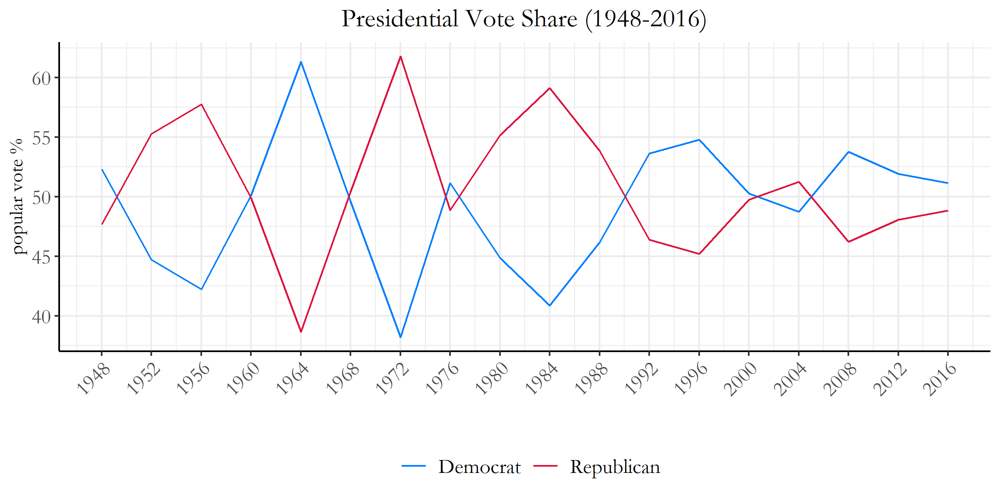
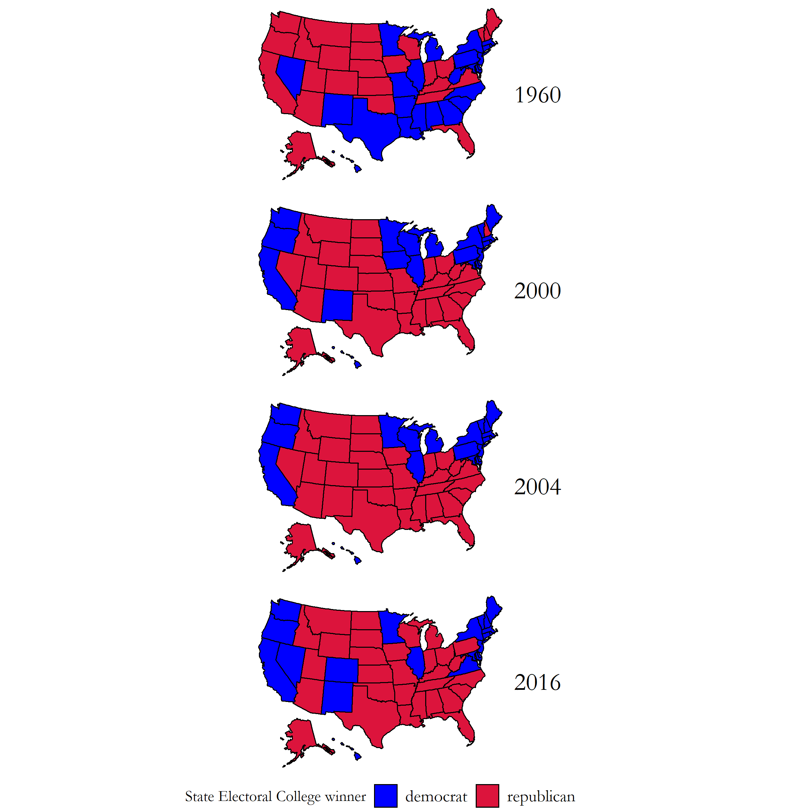
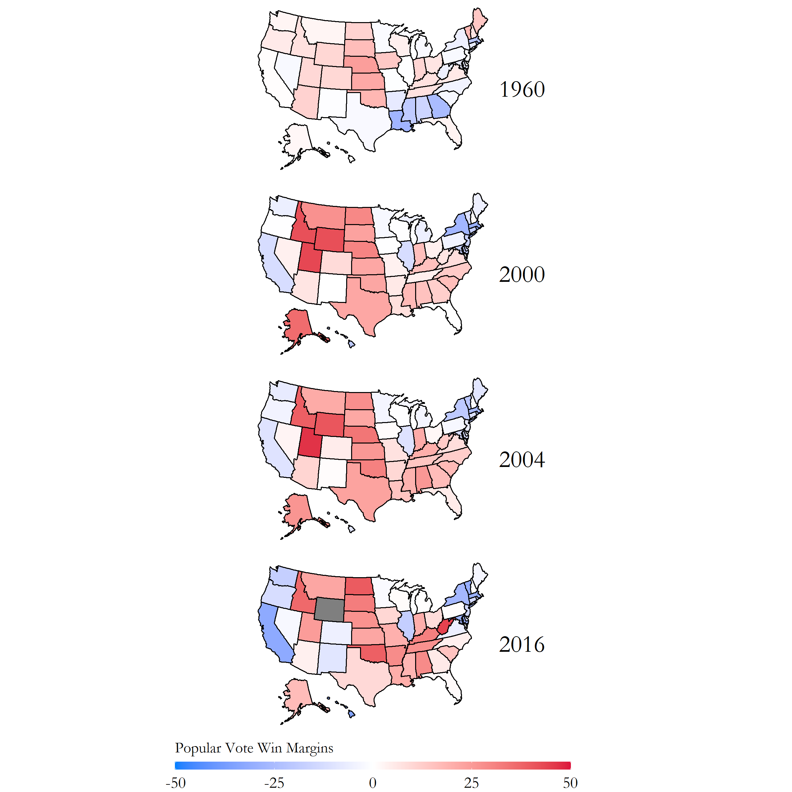
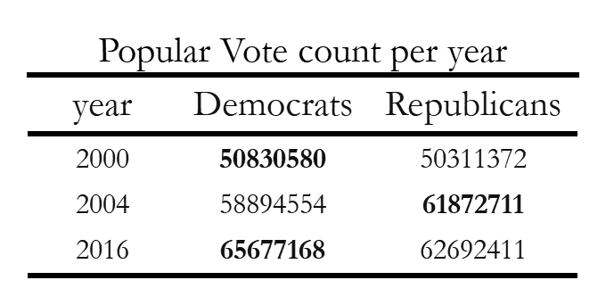
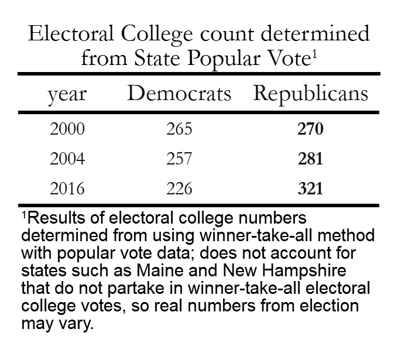

# Blog 1: Introduction
## 9/14/20

### Introduction

What do you think of when the months go by and we finally reach November? Thanksgiving? Fall?

Personally, for me, November has been extra days off school, some thanksgiving KFC dinner with family, but also **elections**. Keeping up with the daily news on how each of the candidates are fighting on each state's polls has been pretty exciting for me; so for the year of 2020, I will be creating data visualizations and blog posts following the directions, twists, and turns of this presidential election!
Now, lets begin the countdown to the election.

#### Presidential Vote Share History

Tracking presidential vote share data from 1928-2016, it’s clear that the polls fluctuate widely year to year with the United States’ two-party system (Figure 1: Presidential Vote Share). A large chunk of voters do not seem to carry preferences towards specific parties during the presidential elections observing how easily the popular vote switches from party to party every 4 years. This is exhibited especially on the years of 1964 to 1972, where party preferences switched drastically from each election cycle.   

[Figure 1: Presidential Vote Share](../Rplots/week1/PV_national_historical.png)

However, as we get closer to the present, the margin of victory over the popular vote appears to be decreasing. This suggests that party identification seems to play a larger influence on each individual’s voting preference for the presidency. Due to these changes, there can be some unforeseen changes within the relationships we see between the electoral college and the popular vote- when the popular vote win ratios are on the much smaller side.

### Electoral College Maps ~ Close Elections

So in the past, there have been many elections where the win margins were by a landslide. For some others though, not so much. 

On the next few graphics, we will be looking at some of the data of the closest presidental elections in the past 60 years. Specifcally, the years 1960, 2000, 2004, and 2016. 

[Figure 2: Electoral College States Map](../Rplots/week1/EC_states_historical.png)

Just looking at the figure map above, there doesn't seem to be anything too off with these graphs. If you want to know who won for each specific year, in the 1960 election the winner was (D) John F. Kennedy, 2000 and 2004 was (R) George W. Bush, and 2016 as you all should know was (R) Donald J. Trump.

#### Popular Vote Win Margins

Now having seen those, you would expect that the electoral college accurately reflected the majority of what the popular vote indicated as winners within this election; however, when we see the following graph, we might start doubting ourselves. This graph depicts the Popular Vote Win Margin percentages of each state with the appropriate color scale on the bottom.

[Figure 3: Popular Vote States Map](../Rplots/week1/PV_states_historical.png)

What does this plot mean? Where did we go wrong? Before you start losing faith in our elections, let me explain. In the United States presidential elections, the electoral college system designates each state a certain number of electors based on its total number of representatives in congress. Each elector casts one electoral vote following the general election, which gives a total of 538 electoral votes. The candidate that gets more than half (270) wins the election!

But then, where does the popular vote come in? Well, most states have a winner take all system (except Maine and New Hampshire) where if a candidate wins the majority of the popular vote in that state, they get all of the electoral college votes within that state. So, we do vote for the president... indirectly.

The differences between the popular vote state map and the electoral college state map show how the electoral college can often cause a candidate to recieve an disproportionate lead within the electoral college that is not reflected within the popular vote. That was a long sentence. It'll be more clear in the following tables.

### Popular Vote Table

Now, take a look at the table below. This table has the same years as before (except 1960 because of some missing data), and shows the Popular Vote count per election year for the Democratic and Republican parties. According to this popular vote count, it shows that in 2000 (D) Al Gore, 2004 (R) Bush, and 2016 (D) Clinton should have all respectively won their election.

[Figure 4: Popular Vote Table - Close Years](../Rplots/week1/output.png)

#### Electoral College Vote Table

However, now take a look at the Electoral College Vote Table.

[Figure 5: Electoral College Table - Close Years](../Rplots/week1/electoral.png)

It doesn't accurately reflect the results for both the 2000, and the 2016 elections! It only accurately reflected the 2004 election for Bush. This causes some large disconnections within the popular vote and the electoral college, as candidates who have voter support concentrated in a few states will ultimately lose to candidates who have more widespread support (but lower popular vote count) in multiple states.

But this is the system we have at the moment, so we will have to see how this affects the upcoming 2020 election.

### So... what? VOTE!

Something that I haven't told you is that despite all of those fancy numbers about the popular vote and the electoral college, this voter data is not complete.

Take a look at the voter turnout rates from the past 2016 election.

[Figure 6: Voter Turnout](../Rplots/week1/VoterTurnout_states_2016.png)

Most states didn't reach the full 100% of voter participation from all eligible voters. A good number of states didn't even reach 50% of voter participation from all eligible voters!

We need to make sure everyone's vote gets counted; the voice of the US consituency is not completely accounted for at it's current state! So go register to vote!

