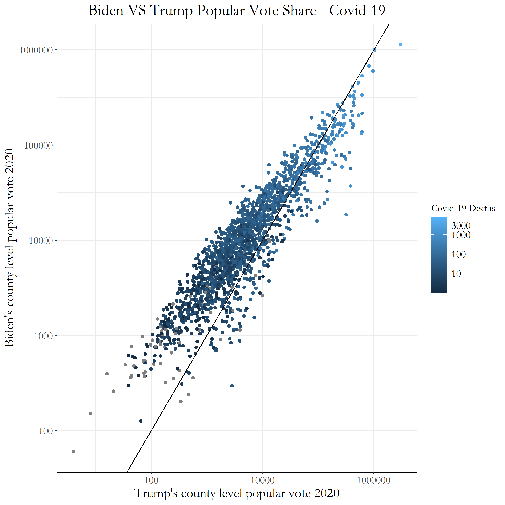
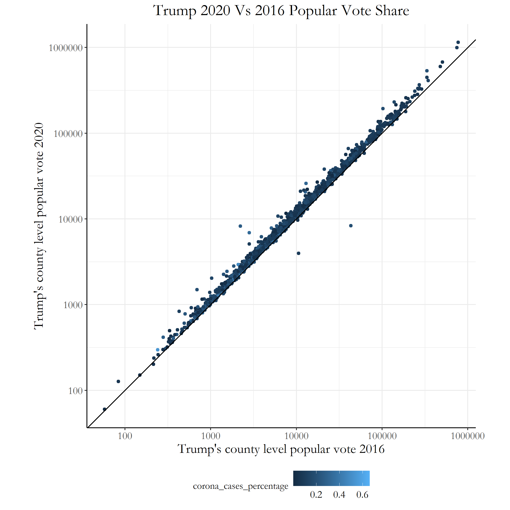

# Blog 10: Testing Narratives - Covid-19
## 12/10/20

### The current state of the 2020 election results

So now, we've known for weeks that President-Elect Biden has won the 2020 Presidential election as the 46th president of the United States. He has now officially secured enough electors to be elected president by the electoral college, and some of the process for the transition of power from the two candidates have started to take place.

However, we can still learn a lot from this election now that it is over. First of all, there are numerous election narratives that are still being developed of why Biden may have won and why Trump may have lost. One narrative that we will try to explore this week, is the IMPACT of Covid-19 on the 2020 election. There have been many conflicting narrative views on this topic; for example: [‘My Frustration Turned Into Anger.’ Some Americans Who Lost Family Members to COVID-19 Have Turned Against Donald Trump](https://time.com/5913055/covid-19-grief-politics-trump/) while some other source make claims such as [The Political Coronavirus Paradox: Where the Virus Was Worst, Voters Supported Trump the Most](https://time.com/5910256/covid-19-presidential-election-outcome/) Due to the conflicting views on this topic, we will try to run a testible implication to see which of these narratives have initial evidence that that the data seems *consistent* with the claims.

## Summary of the Narrative: Covid 19 and 2020 election

This election year was full of many unexpected shocks for both sides, the Covid-19 pandemic being one of the largest factors for these events. The pandemic affected all stages of how the election was run, from the campaining (many events had to be changed to a virtual format), the polling stations (to ensure a clean, safe voting space), absentee voting rates, and much more.

The pandemic also brought multitudes of hardship for many families with the loss of loved ones, the drop with the economy, and the sudden rise of unemployment. The level of strains on the American people suffering these shocks would typically put the incumbent in the election year at a much worse state. However, President Trump has not lost the 2020 election at a huge landslide that many individuals predicted due to the Covid-19 pandemic. This then brings our narrative: The Coronavirus pandemic actually **supported Donald Trump in his efforts to win the reelection**. 

I don't think many indiviudals would disagree that the Covid-19 pandemic was an incredibly impactful event within the 21st century. Understanding how Covid-19 impacted voters' ideas and behaviors this election would provide large insights to how voters react to shocks within an election, as well as economic hardship, polarization, and a multitude of other factors as well. Although the pandemic created a completely different story for 2020, it does also shed light on many factors that could have been overlooked within election predictions for future years. 

### Testable implications

Several factors that I want to explore for testable implications of this narrative are the following:

- Covid 19 death rates and popular vote levels (comparing both Biden and Trump)
- Comparison of popular vote levels for Trump in 2016 VS 2020 arranged based on Covid-19

These two pieces would be able to easily show us whether or not the popular vote had large changes with covid-19 as a factor. By first comparing Biden's and Trump's county level popular votes, we will be able to see if counties that had higher level covid-19 deaths tended to vote more in favor of Trump rather than Biden.

Then after testing those initial data points, we can then test whether or not Trump's popular vote numbers increased from the previous election cycle. We can plot the Covid-19 case percentages onto the same graph as a color variable, and see if observing those Covid-19 factors seem to have any consistent trends with the changes in Trump's popular vote percentages.

### Collected Data
The data I collected for this test included data sets for the county level popular votes from the 2020 election (provided by Professor Enos), the county level popular votes from the 2016 election from the [MIT Election Lab](https://dataverse.harvard.edu/dataset.xhtml?persistentId=doi:10.7910/DVN/VOQCHQ&version=6.0), and finally the Covid county level data sets from [The New York Times](https://github.com/nytimes/covid-19-data). 

I had to make sure that these three datasets could all be merged together to create the proper plots that I wanted to show. The Covid-19 numbers were also plotted as a color variable in order to incorporate 3 different variables for each graph that will be shown in the next section.

### Results of Test; was it true?

Lets finally look at the plots of our testable implications!

The first Figure below compares Biden's and Trump's Popular Vote counts by each county. We also included the Covid-19 Death counts in this graph through the use of the color function; so if we wanted to see if our testable implication was correct, a trend we would need to see is that most of the points on the upper right of the graphic would be light blue, with the points falling under the y=x line. This means that Trump would have a higher popular vote count in that county compared to Biden, with there being a higher death count in that county. 

[Figure 1: Biden VS Trump Popular Votes with Covid](../Rplots/week10/BidenVsTrumpCovid.png)

We do see lighter blue colors at the top right of the graph, but this is most likely because those points are the counties with larger populations of voters. I don't think this shows the large consistency to the initial narrative we had: Covid-19 helped Trump in the 2020 election; matter of fact, it doesn't seem to have had a large impact on Biden's popular vote counts as well.

Now lets look at Figure 2 and see if there is a consistent correlation between the popular vote counts Trump got in 2020 and 2016. Again, we would need to have lighter blue colors at the top right of the graph with most of the points lying on top of the y=x line (which shows that Trump had a higher vote count in 2020 than 2016).

[Figure 2: Trump Popular Votes in 2016 and 2020](../Rplots/week10/2020vs2016.png)

Looking at this graph we can see that all of the points are slightly above y=x, which most likely was just population growth over the 4 years in each of the counties. There also does not seem to be a large consistency in the Covid-19 Cases percentages when we look at the color spread within the graph.

So after looking both at of our graphs, we have no large consistencies with our testable implications and our narrative; Covid-19 seemd to have less of an impact on this election than we had previous thought.
