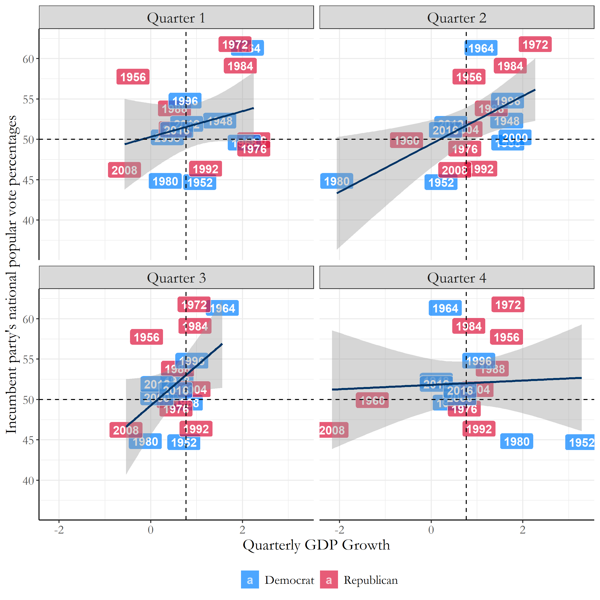
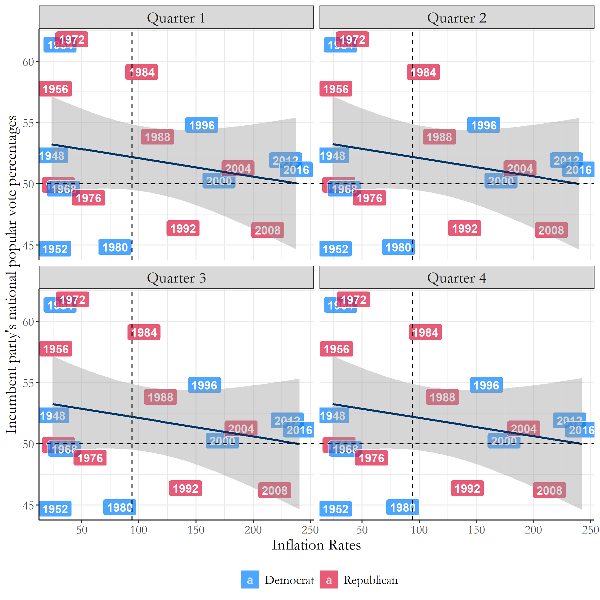
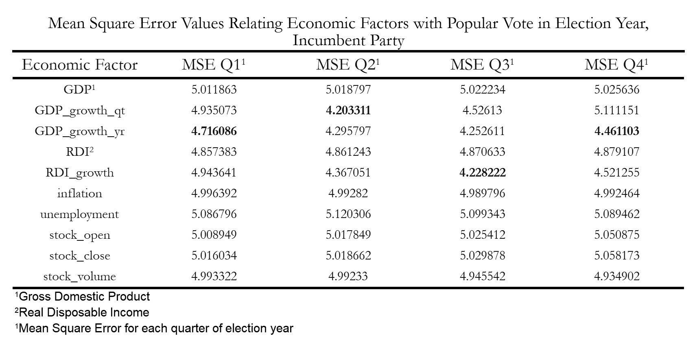
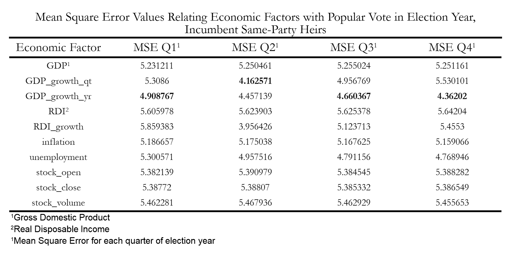
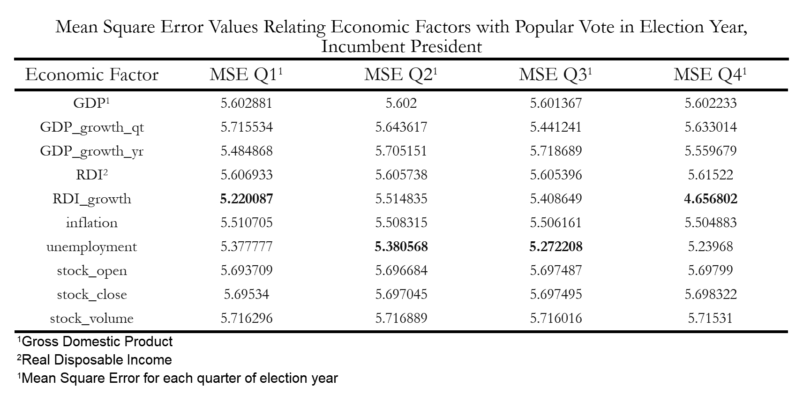
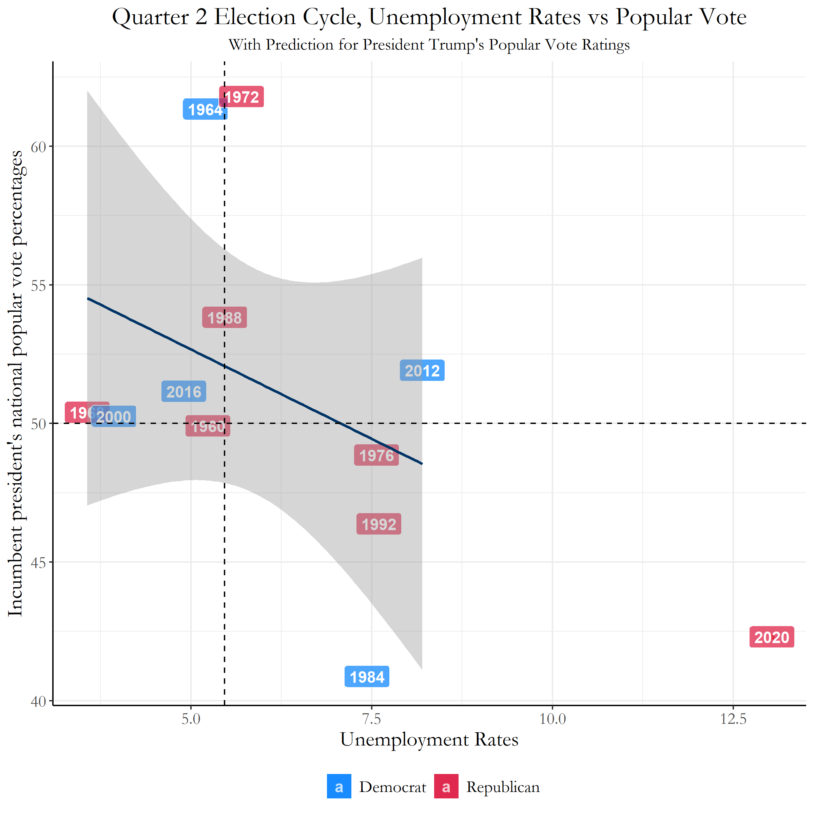
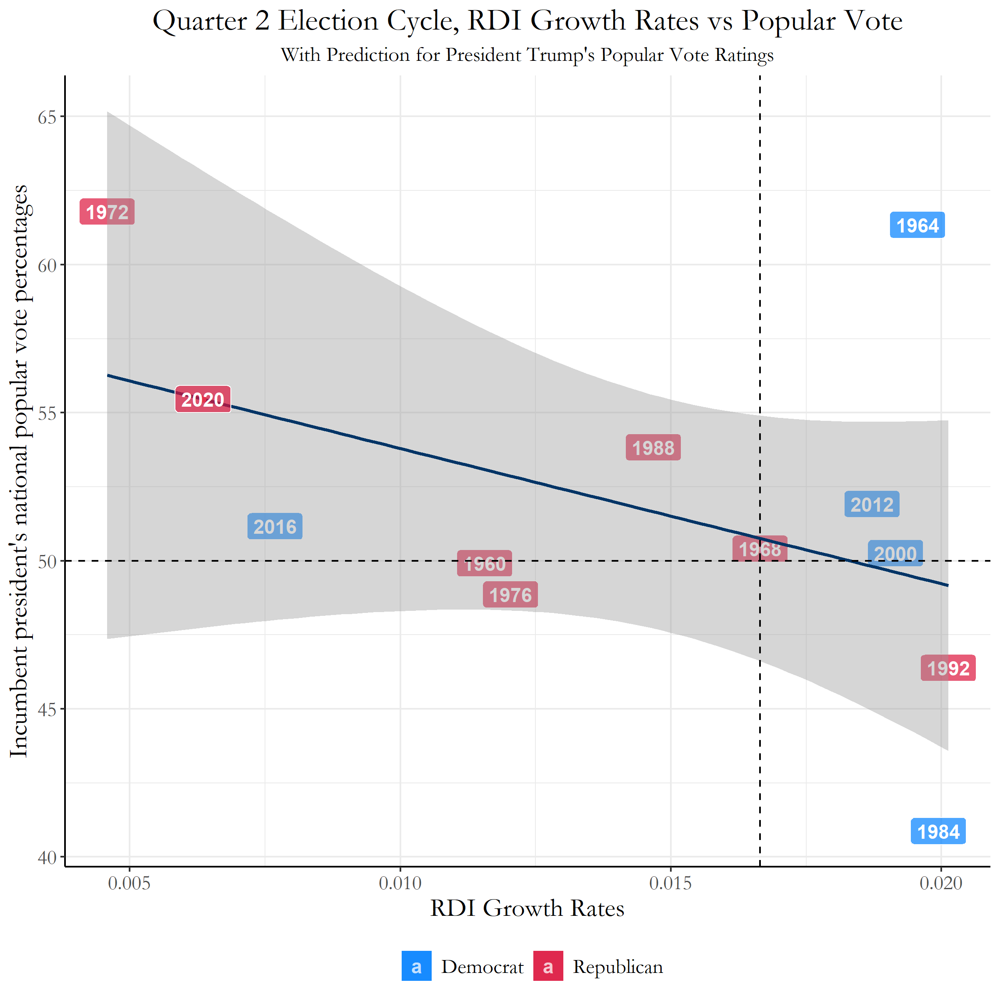

# Blog 2: The Economy
## 9/21/20

### Introduction to Economic Voting

One major factor that may influence a voter’s decision in an election is the state of the economy. Some of this retrospective (looking at the past) economic thinking include thoughts like, “Do I have more money in my pocket?", "Is the country economically stronger overall than 4 years ago?” and many others.

The economic factors that a voter utilizes to judge incumbent candidates can be either direct or indirect. For example, voters can react directly to an election cycle from the loss of their occupation, or base their vote on the country’s GDP (Gross Domestic Product) growth within the past few years. For this week’s blog post, we are using the economy as a proxy to describe how voters behave in elections, but in future blog posts we will need to find more direct variables that can measure specific experiences of voters (and possibly their final votes!).

#### What correlations exist between the economy and popular vote?

There are so many economic variables we could utilize to properly predict the popular vote; some of these factors include (as previously mentioned):
* GDP (Gross Domestic Product)
* GDP Yearly Growth
* GDP Quarterly Growth
* Unemployment
* Real Disposable Income Growth
* Stock Market
* Inflation
* etc…

In order to find economic variables with the highest correlations with popular vote, I first plotted linear regression models relating popular vote data from the years of 1948-2016 with each economic variable. Each of the models look like the model below (Figure 1), with data from each quarter of the election year; this figure specifically is an example of popular vote plotted against Yearly GDP growth (which was calculated by finding the difference between the previous year’s quarter and the election year quarter).

[Figure 1: Quarterly GDP Growth VS Popular Vote](../Rplots/week2/QuarterlyGDPGrowth.png)

Figure 1 is a great example of a *positive* correlation between the economy and the popular vote, as an increase within the quarterly GDP growth corresponds to a rise within the incumbent party’s national popular vote percentages.  There also can be models with *negative* correlations between economy and the popular vote, an example including inflation rates in Figure 2.

[Figure 2: Inflation VS Popular Vote](../Rplots/week2/Inflation.png)

This figure doesn't necessarily represent a model with a very *high* negative correlation, but it does show us a negative relationship nevertheless.

### Which economic factors have the highest correlations with popular vote?

With all these options for modeling correlations between the economy and popular vote, which should we use to predict this year’s election? 

We have a very useful tool on our side: Mean Squared Error, which can sum up in a single number the level of error we have between our set of point data and our regression line. This is done by taking the distances from the points to the regression line (which we can use as the “errors”) and squaring them- which provides us only positive values. Later, we take the average of these set of errors, hence the method being named *mean* squared error. The smaller the mean squared error, the better our linear regression model. When comparing all of the Mean Squared Error (MSE) Values in Figure 3, we can clearly see which models perform the best.

[Figure 3: Mean Squared Error Table](../Rplots/week2/MSE_Economy.png)
 
Figure 3 specifically focuses on the MSE values of economic variables measured during election years. From this table, some of the highest correlating variables include the quarterly GDP growth, the yearly GDP growth, and finally RDI (Real Disposable Income) Growth. The high correlations within these three variables provide us some insight in how we make decisions as voters. The first two within the quarterly and yearly GDP growth suggest that most Americans are influenced by sociotropic values, as they are concerned with the collective economic state of the country, while the last variable, RDI growth, suggest that individual financial concerns also contribute to the decisions people make for their final ballot.

Utilizing these findings, we can continue similar analysis methods to see how the economy affects sitting presidents running for re-election compared to same-party heirs seeking the office.  

#### Incumbent Same-Party Heirs Vs. Incumbent President... Is there a Difference?

With all of this analysis with the economy and the popular vote, another question you may have is, *does the economy affect incumbent same-party heirs differently than the incumbent presidents running for office?*

This was something I wanted to explore more deeply, so I ran a similar MSE - Mean Squared Error analysis on both incumbent same-party heirs and incumbent presidents to see which economic variables were most influential in voter decisions.

So lets see the data.

### Incumbent Same-Party Heirs

When we look at the MSE values for our incumbent same-party heirs, some of the things we can see immediately are that the economic factors with the lowest MSE values are either Quarterly or Yearly GDP Growth.

[Figure 4: Mean Squared Error Table, Same-Party Heirs](../Rplots/week2/MSE_Economy_IncumbentParty.png)

This implies that for incumbent same-party heirs, voters are more likely to consider economic factors that are more sociotropic such as the GDP. Intuitively, it does make sense that voters would use information they have of how the previous incumbent party performed on the collective economic state of the country, as constituents have not had experience with these same-party heirs in office.

#### Incumbent Presidents

When we look at the MSE values for our incumbent presidents, we can see that some of the lowest MSE values have changed: the lowest MSE values have shifted to focus more on RDI - Real Disposable Income growth and unemployment rates. Another thing to note below in Figure 5 is that most of these MSE values are higher compared to the values from Figure 4. This utimately means that the models we have for sitting presidents have lower predictive accuracy rates than same-party heirs.

[Figure 5: Mean Squared Error Table, Incumbent President ](../Rplots/week2/MSE_Economy_IncumbentPres.png)

The economic variables with the lowest MSE values for incumbent presidents were mostly centered around individual financial concerns for voters, which is a stark change from same-party heirs. Both RDI growth and unemployment rates are much more directly correlated to voters' financial stability, which indicates that voters use more of their personal experiences when judging the performance of incumbent presidents rather than the entire state of the country.

### Predictions: President Trump's Popular Vote Percentages on Unemployment Rates

Now utilizng the information we have from the previous Incumbent President's MSE values table in figure 5, we can try to predict President Trump's Popular Vote percentages utilizing this incumbent president data. We will be predicting the popular vote percentages for this election year from the unemployment rate data from quarter 2 and the RDI growth rates from quarter 1.

From the unemployment data, with 2020's quarter 2 unemployment data equaling 13.0, we were able to find in Figure 6 that the predicted popular vote percentage for Trump was 42.3%.

[Figure 6: Trump Predictions - Unemployment ](../Rplots/week2/unemploymentPredictionTrump.png)

This can be seen from the significant drop from previous unemployment rates to the present day unemployment rates resulting from COVID-19.

From the RDI growth rates data, with 2020's quarter 1 RDI growth rate data equaling 0.00636, we were able to find in Figure 7 that the predicted popular vote percentage for Trump was 55.5%.

[Figure 7: Trump Predictions - RDI Growth Rate ](../Rplots/week2/RDI_GrowthPredictionTrump.png)

This may be due to the rise of RDI from stimulus checks provided by the government during the pandemic, which may not be completely representative of the entire situation currently in 2020.

