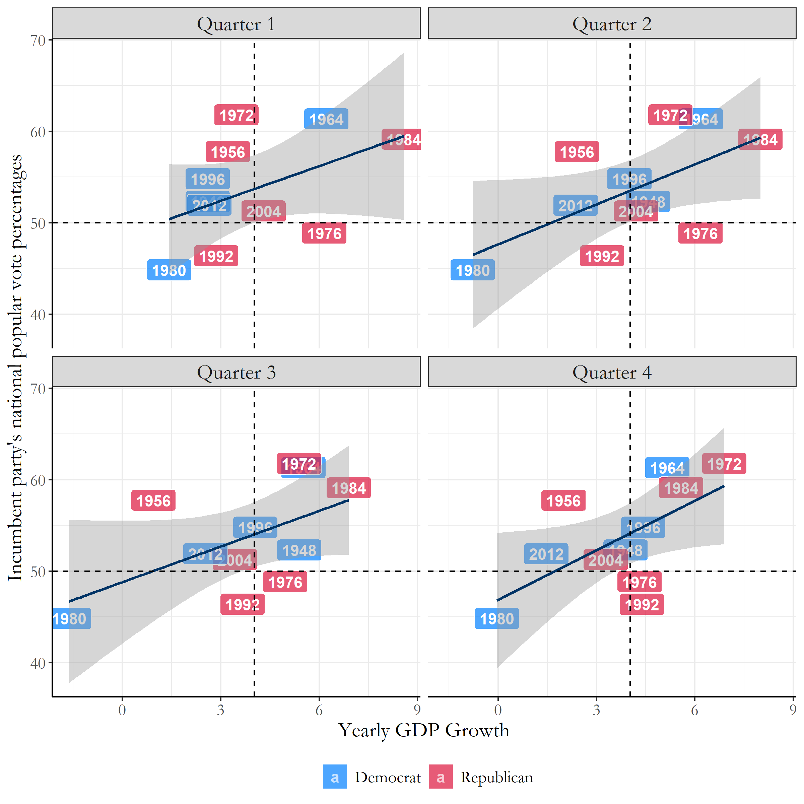
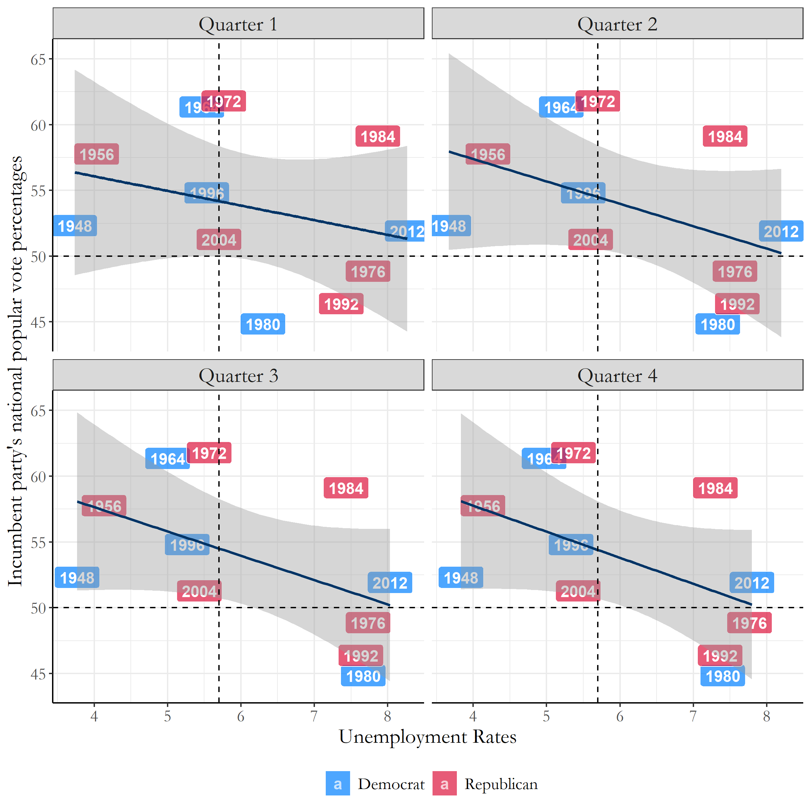
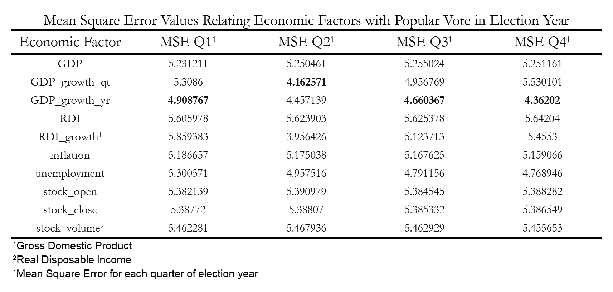

# Blog 2: The Economy
## 9/21/20

### Introduction

One of the major factors that may influence a voter’s decision in an election is the economy. Some of this retrospective (looking at the past) economic thinking can include thoughts like, “Do I have more money in my pocket than before? Is the country overall stronger economically than 4 years ago?” and many others.

The economic factors that a voter utilizes to judge incumbent candidates can be either direct or indirect. For example, voters can react directly to an election cycle from a losing a job or base their vote on the country’s GDP (Gross Domestic Product) growth within the past few years. For this week’s blog post, the economy acts as a proxy of how people behave, but in future blog posts we will need to find more direct variables that can measure specific experiences of voters and their final votes.

#### What correlations exist between the economy and popular vote?

There are so many economic variables we could utilize to properly predict the popular vote; some of these factors include (as previously mentioned):
* GDP (Gross Domestic Product)
* GDP Yearly Growth
* GDP Quarterly Growth
* Unemployment
* Real Disposable Income
* Stock Market
* Inflation
* etc…
In order to find the variables with the highest correlations with popular vote, I plotted linear regression models onto the popular vote data we have from 1948-2016 with corresponding data for each economic variable. Each of the models look like the model below (Figure 1), with data from each quarter of the election year; this figure specifically is an example of popular vote plotted against Yearly GDP growth (which was calculated by finding the difference between the previous year’s quarter and the election year quarter).

[Figure 1: Yearly GDP Growth VS Popular Vote](../Rplots/week2/YearlyGDPGrowth.png)

Figure 1 is a great example of a **positive** correlation between the economy and the popular vote, as an increase within the yearly GDP growth corresponds to a rise within the incumbent party’s national popular vote percentages.  There also can be models with **negative** correlations between economy and the popular vote, a strong example being unemployment rates in Figure 2.

[Figure 2: Unemployment Rates VS Popular Vote](../Rplots/week2/unemployment.png)

### Which economic factors have the highest correlations with popular vote?

With all these options for modeling correlations between the economy and popular vote, which should we use to predict this year’s election? 

We have a very useful tool on our side: Mean Squared Error, which can sum up in a single number the level of error we have between our set of point data and our regression line. This is done by taking the distances from the points to the regression line (which we can use as the “errors”) and squaring them- which provides us only positive values. Later, we take the average of these set of errors, hence the method being named *mean* squared error. The smaller the mean squared error, the better our linear regression model. When comparing all of the Mean Squared Error (MSE) Values in Figure 3, we can clearly see which models perform the best.

[Figure 2: Unemployment Rates VS Popular Vote](../Rplots/week2/MSE_Economy_ElectionYear.png)
 
Figure 3 specifically focuses on the MSE values of the economic factors measured during election years. From this table, some of the highest correlating variables include the quarterly GDP growth, the yearly GDP growth, and finally unemployment rates. The high correlations within these three variables provide us some insight in how we make decisions as voters. The first two within the quarterly and yearly GDP growth suggest that most Americans are influenced by sociotropic values, as they are concerned with the collective economic state of the country, while the last variable, unemployment rates, suggest that individual financial concerns also contribute to the decisions people make for their final ballot. Utilizing these findings, we can continue to focus our analysis of economic variables on those three factors, as we next explore how the economy affects sitting presidents running for re-election compared to same-party heirs seeking the office.  
