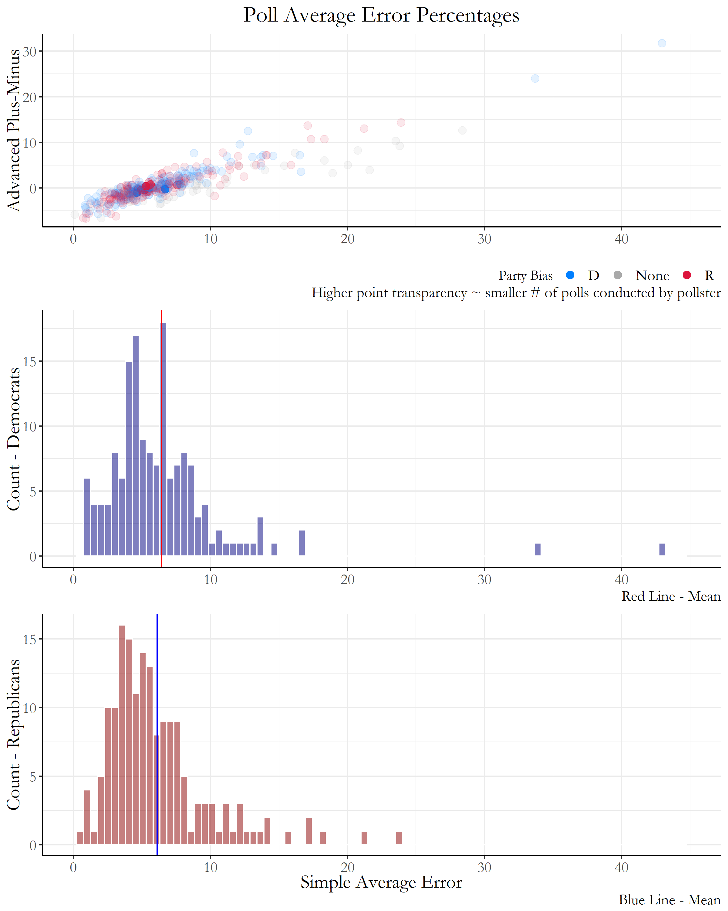
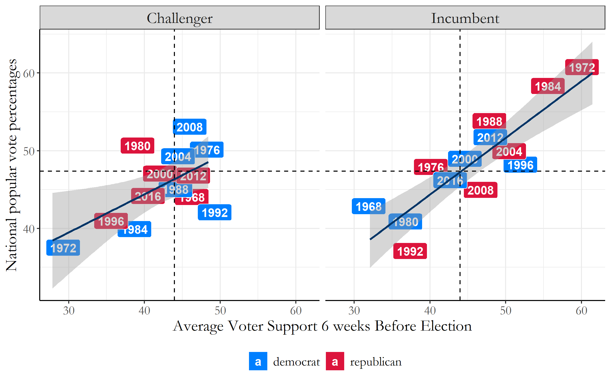
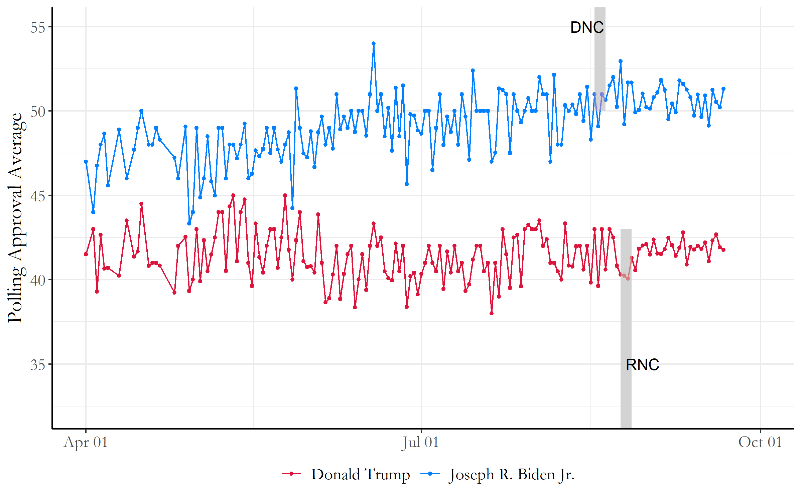
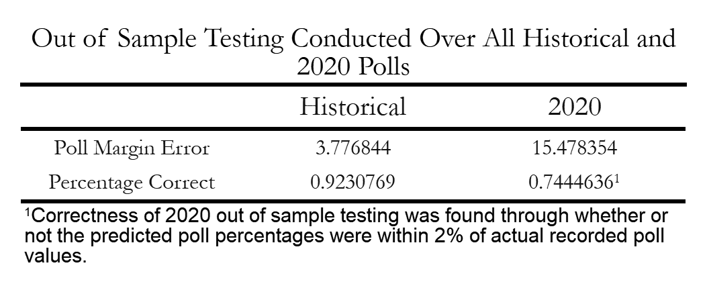
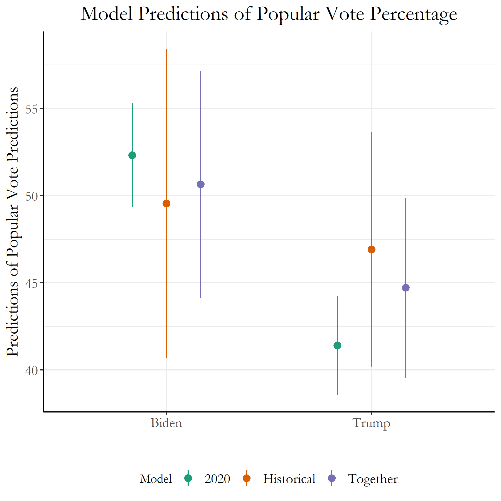

# Blog 3: The Polls
## 9/28/20

### Polling

Polls are one of the best ways we can get *direct* access to the preferences of voters before the actual election. By taking a diverse and large sample of voter preferences, polling provides us a way to truly guage how voters are thinking in the days before the election that immutable variables like the economy cannot. However with polls, they have their own sets of disadvantages. When taking data from individuals way in advance of an election, this doesn't take into account that preferences might change due to future events closer to the election. With Differential non-responsive bias, certain participants are disproportionately likely not to rspond to the poll, not representing the total population correctly. Seeing these issues begs the question: **how accurate are polls?**

## Polling Average Error

The following figure was created with FiveThirtyEight's Pollster Ratings data available from [github](https://github.com/fivethirtyeight/data/tree/master/pollster-ratings), and specifically focused on the average error of each pollster during the 2016 general election. 

[Figure 1: Polling Average Error](../Rplots/week3/pollQuality2.png)

For the *simple average error*, this variable calculated for each pollster the difference between the polled result and the actual result for the margin separating the top two finishers in the race. *Advanced Plus-Minus* is a score that compares a pollster's result against other polling firms surveying the same races and that weights recent results more heavily. Negative scores are favorable and indicate above-average quality. 

The top scatterplot in Figure 1 clearly exhibits a correlation between the Advanced Plus-Minus variable with the simple average error, with higher simple average error leading to a worse score in Advanced Plus-Minus. Most of the polls are concentrated in the lower left region of the plot, with most simple average error percentages around 5-7%. Although that percentage error definitely can either make or break specific election results (resulting in wrong overall predictions through polls) we definitely can use this information to our advantage by aggregating multiple poll results together rather than looking at each individual poll separately.

The two histograms below the scatterplot also show similar simple average error means and distributions for polls with bias towards Democrats, and polls with bias towards Republicans, proving there are limited differences in average poll error even when considering party bias.

### Modeling with Polls - Historical Election Data

First, lets analyze and model the election using historical poll data from previous elections. Below, Figure 2 plots the average voter support against final popular vote data 6 weeks before each election. The challenger and incumbent are separated into two models.

[Figure 2: Historical Election Polling Data](../Rplots/week3/PopularVoteVSPolling.png)

For the incumbent, every percentage increase in *avg_support* results in a **0.7294** increase in the popular vote. The results are seen to be statistically significant as the *t-value* is seen to be **6.966**, which is larger than 2 (the baseline acceptable value). The higher the t-value, we can have greater confidence in the coefficient we found to be a predictor.

Now for the challenger, every percentage increase in *avg_support* results in a **0.4907** increase in the popular vote. The results are seen to be statistically significant as the *t-value* is seen to be **2.692**, but we do have a lower confidence value in this coefficient in predicting the challenger's popular vote based on polling information.

## Modeling with 2020 Polls!

With the upcoming November election, (36 DAYS!) we can try to plot the polling approval average of the two candidates over time to see if there are any trends we can track of overall voter support. In Figure 3, the average polling approval ratings are plotted against the months of April to October for both the Democratic and Republican nominees. There seems to be no significantly large dips or gains from either candidate, but with at least a month to the election there could be many surprises.

[Figure 3: 2020 Election Polling Data](../Rplots/week3/JoeVSDonald.png)

For Donald Trump, each passing day results in a **0.000156** decrease in the polling averages. These results are not very statistically significant seeing as the *t-value* is **-0.07**, a much smaller value than the baseline number 2. In addition, the *R-squared error* is on the magnitudes of **10^-5**, indicating that the model is not fitting the actual data very well. These values indicate that our model for predicting Trump's polling averages for the November election are not very reliable, and we may need other variables to properly model the data.

Now these models show a much more different picture for Joe Biden. For Biden, each passing day results in a **0.02511** increase in the popular vote. The results are statistically significant as the *t-value* is **10.54**, one of the highest we've seen with our models so far, which gives us some assurance that this model may be accurate in predicting Biden's polling percentages in November.

However, using each passing day(or just time in general) as a variable to predict polling averages don't seem very convincing. Lets start looking at some ways to verify our data.

### Out-of-Sample Testing

With the two datasets we explored previously, now lets try running out-of-sample testing runs for every single data point that are available to us. Running out-of-sample testing procedures for each data point allows us to find the average margin of polling error whenever we do create each of these models, and we can directly test how often we correctly predict the winners with each model. This gives us a better picture overall of whether or not our dataset is reliable enough for us to try and predict data points we don't have access to (such as the 2020 presidential election).

[Figure 4: Out-of-sample Testing Table](../Rplots/week3/OutOfSampleTesting.png)

The historical election polling data seems much more reliable at predicting polling averages and winners for data outside of the sample, as poll margin errors were only **3.78%**. This historical data also correctly predicted **92%** of the winners of the out-of-sample testing which can be considered a high accuracy rate.

For the 2020 polling data, there are much more fluctuations throughout each day which left us with a much larger poll margin error of **15.5%**. Because the actual election results has not been determined yet, the percentage of correctness of 2020 out-of-sample testing was found through whether or not the predicted poll percentages were within 2% of actual recorded poll values. With these calculations, the models within out-of-sample testing were successful of determining poll averages **75%** of the time. This is a bit lower than the historical election polling data, but if we combine the two models together we can probably get a more accurate picture of how the 2020 elections might look.

## Final Predictions Using Polling Data!

Now using our multiple models, lets try and predict popular vote percentages for our two presidential candidates: Joe Biden and Donald Trump.

[Figure 5: Polling 2020 Election Predictions](../Rplots/week3/predictions.png)

For each of the two groups, the line on the very left represents the 2020 polling data model, the center represents the historical polling election data model, and the third line on the very right represents an ensemble model built with the two previous models. The weights for each of the two models in the ensemble model were 0.6 for the historical model, and 0.4 for the 2020 model. It seems like with this current ensemble model, the predicted percentages for Trump is around **44.7%** while for Biden it is **50.7%**. These definitely show a close race, and just a slight error in the percentages could tilt the winner in either direction.