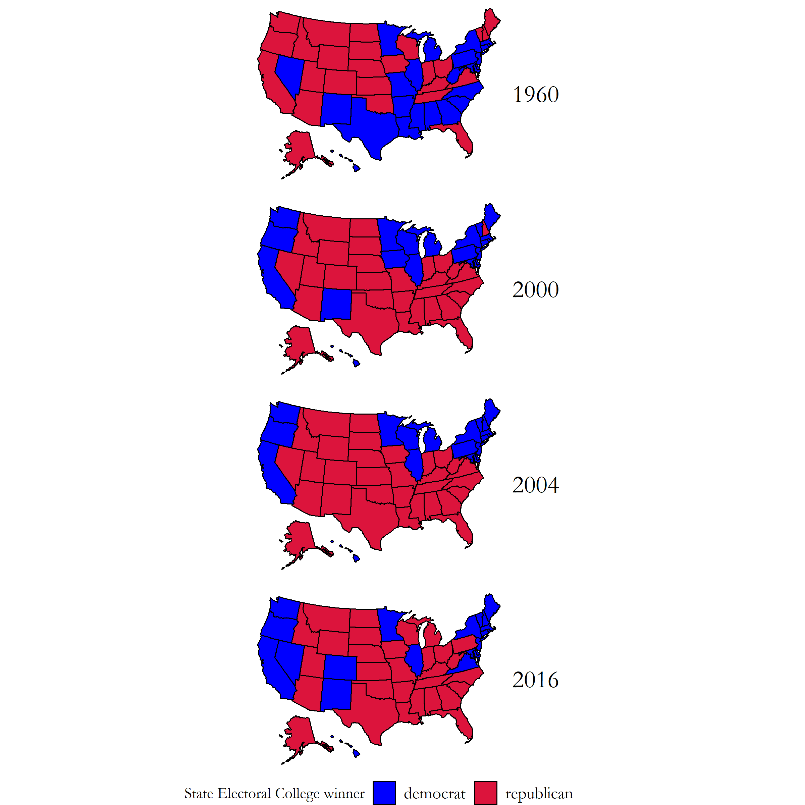
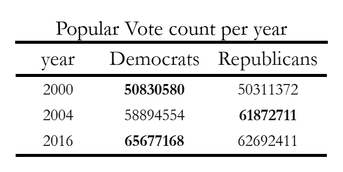
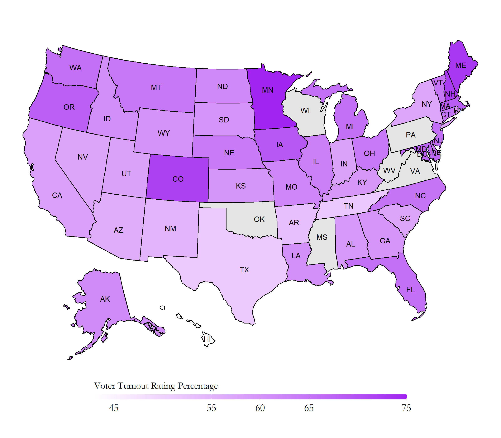

# Blog 4: Incumbency
## 10/5/20

### Incumbency Advantage; is it Real?

Do voters only remember the losses rather than the gains from each incumbent candidates and party? How much of an advantage does incumbency give a candidate? How about party?

When considering the incumbency advantage in elections, there has been conflicting views in the literature of how much incumbency itself affects the final decisions for voters. In the Journal of Experimental Political Science, Brown[^1] suggests that voters don't have strong general preferences for or against incumbent candidates in elections when all other factors are set equal. In another journal article from PS: Political Science and Politics, Campbell[^2] suggests that imcumbent presidents tend to have higher popular vote ratings than incumbent parties that are who have held the white house for 2 or more terms.

Lets look back at the past elections between the years of 1948-2016 in Figure 1. The number of incumbent presidents who were reelected were 6 out of 17; the number of incumbent party candidates who won the election were 2 out of 17. The rest were won by the challengers.

[Figure 1: Incumbent Presidential Reelection Winners ](../Rplots/week4/IncumbentPresW.png)

These results show us that there seems to be a pretty well maintained balance between winners between incumbents (whether that be party or president) and challengers. Voters tend to like having these periodic alterations in power between the two major parties, and we'll explore which economic factors tend to favor one party versus another in incumbency.

But first, lets see how popular vote distributions are between incumbent candidates (as either president or party) and challengers.

## Challenger V.S. Incumbent Candidates Popular Votes

In Figure 2, we can track the patterns and trends of voters swaying from challenger to incumbent every election year. The triangles represent the challenger, and the circles represent the incumbent. Each of the candidates are also colored by the specific party they represent. 

[Figure 2: Popular Vote Between Incumbent Candidates and Challengers](../Rplots/week4/ChallengerVsIncumbent.png)

There are very steady transitions within this graph, where the voters choose to elect the challengers typically every two cycles, and whenever the challenger does win, it also marks a switch in the political party that is in the white house. Since we know that voters tend to give both incumbents and challengers similar chances, lets revisit the economic models we had in week 2 to see which variables hurt or help incubments and challengers.

### Economy and Incumbency

[Figure 3: Electoral College States Map](../Rplots/week1/EC_states_historical.png)

## Economy and Challengers

[Figure r: Popular Vote States Map](../Rplots/week1/PV_states_historical.png)

### Predictions?

[Figure 4: Popular Vote Table - Close Years](../Rplots/week1/output.png)
 
## Electoral College Vote Table

[Figure 5: Electoral College Table - Close Years](../Rplots/week1/electoral.png)

### Incumbency Advantage

[Figure 6: Voter Turnout](../Rplots/week1/VoterTurnout_states_2016.png)

[^1]: Brown, A. R. (2014).Voters Don’t Care Much About Incumbency. Journal of Experimental Political Science, 1(2):132–143

[^2]: Campbell et al., 2017] Campbell, J. E., Norpoth, H., Abramowitz, A. I., Lewis-Beck, M. S.,Tien, C., Campbell, J. E., Erikson, R. S., Wlezien, C., Lockerbie, B., Holbrook, T. M.,and et al. (2017).A Recap of the 2016 Election Forecasts.PS: Political Science andPolitics, 50(2):331–338.