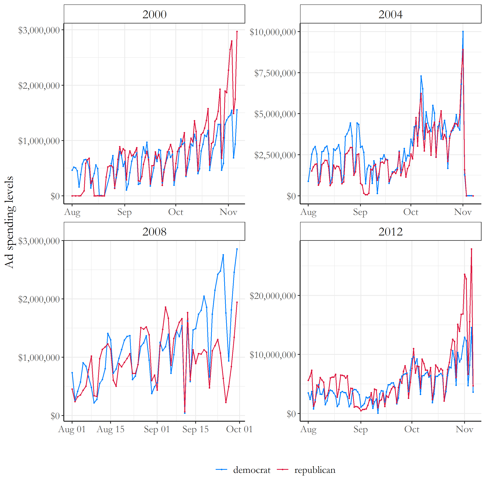
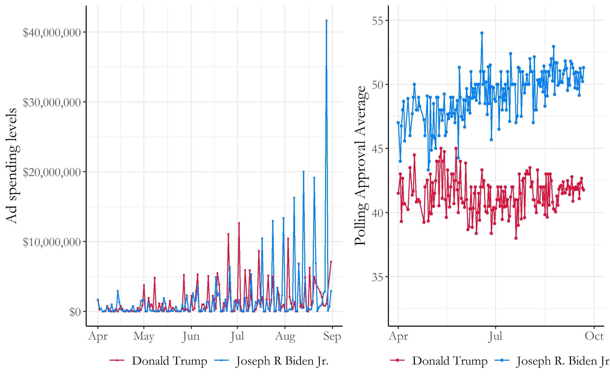
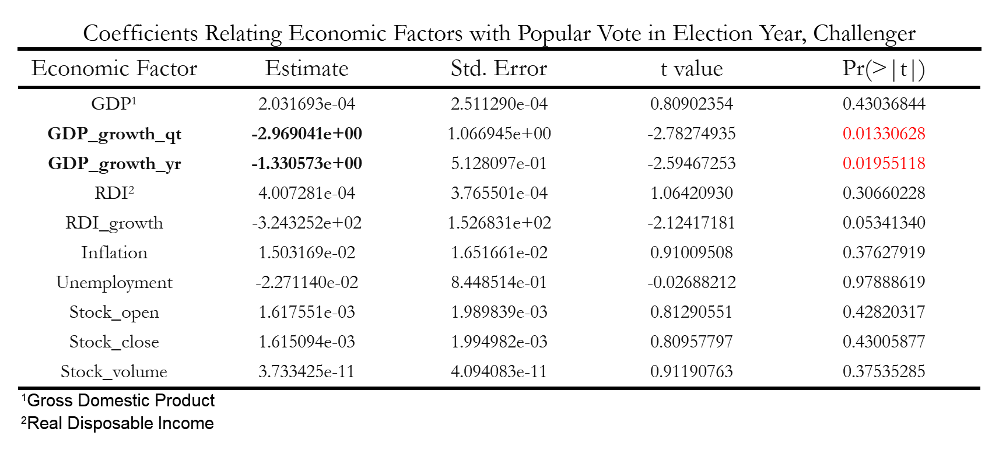

# Blog 5: The Air War
## 10/12/20

### The Air War

After having looked at the fundamentals in previous weeks: economy, incumbency, etc, we are now shifting our perspective to the study of campaigns through the Air War this week.

Some things that we know are that campaigns can be iconic! Campaigns spend millions of dollars in order to win the presidential seat, and it seems important to answer the question: how influential are campaigns to the outcome of an election? 

This question is very difficult to answer because many people don't pay election to politics, and for the individuals that do, changes in media / internet give individuals the ability of selective exposure; this doesn't ensure that all individuals see the materials a campaign uses within the Air War. In addition, the effects of single advertisements tend to decay quickly compared to other fundamental variables in an election.

However, we can try to isolate the effect of advertisements by looking at the **cumulative** effects of advertisements over time. There are two main things that campaign ads aim for when reaching out to voters, including trying to get voters on the fence to support their candidate, or get people that already support their candidate out to vote. 

Lets first explore what typical campaign ad spending looks like over the course of an election year.

## Campaign Ad spending over Time

In Figure 1, we tracked the patterns and trends of presidential campaign ad spending from the years of 2000-2012. Just from looking at the differences in campaign spending over time, we can observe a general increase of campaign ad spending towards the months closer to the election; there also are few peaks and differences a few months early on depending on specific events such as presidential debates.


[Figure 1: Campaign Ad Spending Over Time (2000-2012)](../Rplots/week5/AdSpendingOverTime.png)

If we compare this to the campaign ad spending within the 2020 election (Figure 2), we can see similar trends. Biden has spent an incredible amount of money during the 2020 election, with some of his last advertisement purchases in August to be over 40 million dollars in a day! Trump on the other hand has grew his level of campaign ad spending but not on a dramatically different scale as Biden has. It seems like the 2020 election year has some of the highest spending amounts for campaign advertisements compared to previous presidential election years.


[Figure 2: Campaign Ad Spending 2020 Election VS. 2020 Polling Averages ](../Rplots/week5/JoeVSDonald.png)
*The ad spending data for this plot was provided from https://www.fec.gov/data/*

However when comparing this to the 2020 polling averages data on the right hand graph, there does not seem to be a huge correlation between changes in polling averages over time with campaign ad spending. The lack of similar trends in these graphs indicate how difficult it is to change the opinions of the general public about a candidate, which does come as a surprise considering the huge difference in campaign spending amounts of both major party democrat and republican candidates.

### Biden VS Trump State level spending

Now lets look at the amount of money campaigns spend on ads at each individual state.


[Figure 3: Campaign Ad Spending at the State Level ](../Rplots/week5/statespending_sqrt.png)

According to Figure 3, the 2020 candidates seem to be focusing large portions of their campaign ad spending on Virginia, Georgia, DC, New York, Massachusetts, Nebraska, Pennsylvania, New Jersey, Texas, and Florida. Many of these states are swing states, but some states like California and New York seem to have high levels of campaign ad spending due to large state populations. Trump seems to have concentrated a large portion of his campaign spending in Virginia, compared to Biden who has large portions of campaign ads focused in **Georgia**, Nebraska, Pennsylvania, New York, and California. 

## Economy and Challengers

Running this same procedure with the challengers data we have compared to the economic variables, we don't seem to identify any specific variables that could be accurate in predicting the popular vote for a challenger (Figure 4). 


[Figure 4: Coefficient Challenger](../Rplots/week4/Coefficients_Challenger.png)

None of the t values were over 2, and the only pvalues that were less than 0.05 were GDP_growth_qr and GDP_growth_yr. Unfortunately, we aren't able to get very significant conclusions from this analysis, so we will not be able to predict the percentages of the challenger using this model. However, we will use the three variables identified in the incumbency analysis with economy to see possible predictions for this year's election with Trump.

### Predictions?

Now using the variables we found through the economy and incumbency analysis, we can run a multivariate regression model analysis to see the interactions of these various economy variables together. The following regression analysis was run:
```markdown
  incumbent_mod <- lm(pv2p ~ GDP_growth_qt +
                         GDP_growth_yr + 
                         RDI_growth +
                         GDP_growth_qt*GDP_growth_yr*RDI_growth, 
                    data = dat_incumbent)
```
Where the interactions between GDP_growth_qt, GDP_growth_yr, and RDI_growth were specifically observed. With this model, we have some interesting estimates of Trump's popular vote predictions for this 2020 election.

When using 2020 quarter 1 economy data, we get the following result:
```markdown
      fit      lwr      upr
  61.4618 43.83936 79.08424
```
This seems like a pretty high estimate: 61% of the popular vote, but when we compare this to the 2020 quarter 2 economy data we get an even more unrealistic result:
```markdown
        fit       lwr      upr
  -395.0764 -2037.667 1247.515
```
Again, this is popular vote estimates of Trump at -395% which indicates that this model most likely is not the most accurate in determining the popular vote percentages of Trump in the 2020 election. It seems like when we combine the interactions of the three variables we selected, the effect of each variable magnifies in the same direction which provides us these unrealistic results. We definitely should take this into consideration in the future.

[^1]: Brown, A. R. (2014).Voters Don’t Care Much About Incumbency. Journal of Experimental Political Science, 1(2):132–143

[^2]: Campbell et al., 2017] Campbell, J. E., Norpoth, H., Abramowitz, A. I., Lewis-Beck, M. S.,Tien, C., Campbell, J. E., Erikson, R. S., Wlezien, C., Lockerbie, B., Holbrook, T. M.,and et al. (2017).A Recap of the 2016 Election Forecasts.PS: Political Science andPolitics, 50(2):331–338.