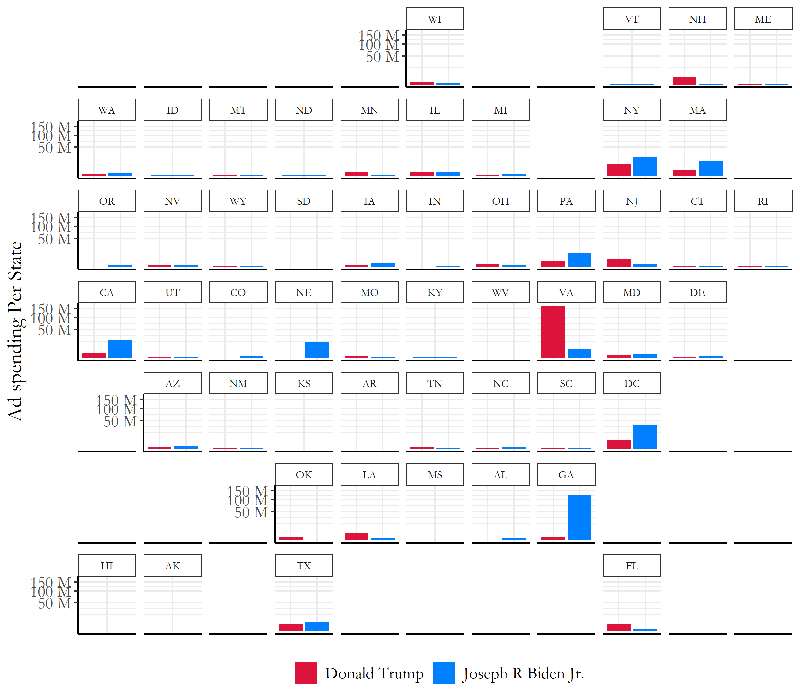
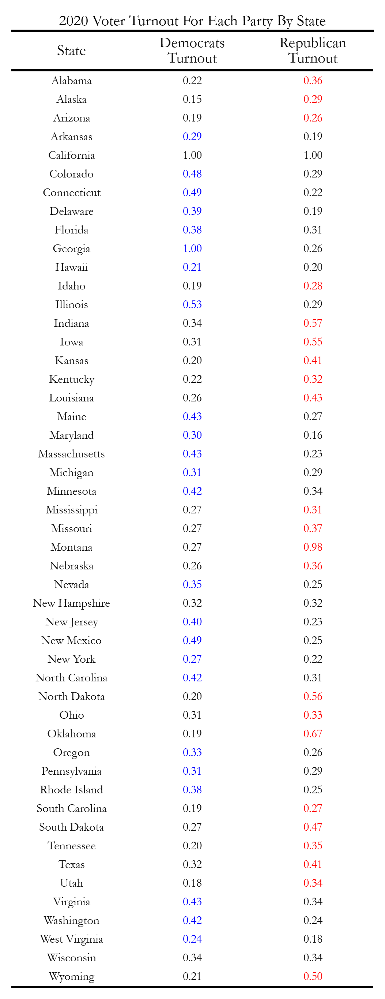

# Blog 5: The Air War
## 10/12/20

### The Air War

After having looked at the fundamentals in previous weeks: economy, incumbency, etc, we are now shifting our perspective to the study of campaigns through the Air War this week.

Some things that we know are that campaigns can be iconic! Campaigns spend millions of dollars in order to win the presidential seat, and it seems important to answer the question: how influential are campaigns to the outcome of an election? 

This question is very difficult to answer because many people don't pay election to politics, and for the individuals that do, changes in media / internet give individuals the ability of selective exposure; this doesn't ensure that all individuals see the materials a campaign uses within the Air War. In addition, the effects of single advertisements tend to decay quickly compared to other fundamental variables in an election.

However, we can try to isolate the effect of advertisements by looking at the **cumulative** effects of advertisements over time. There are two main things that campaign ads aim for when reaching out to voters, including trying to get voters on the fence to support their candidate, or get people that already support their candidate out to vote. 

Lets first explore what typical campaign ad spending looks like over the course of an election year.

## Campaign Ad spending over Time

In Figure 1, we tracked the patterns and trends of presidential campaign ad spending from the years of 2000-2012. Just from looking at the differences in campaign spending over time, we can observe a general increase of campaign ad spending towards the months closer to the election; there also are few peaks and differences a few months early on depending on specific events such as presidential debates.


[Figure 1: Campaign Ad Spending Over Time (2000-2012)](../Rplots/week5/AdSpendingOverTime.png)

If we compare this to the campaign ad spending within the 2020 election (Figure 2), we can see similar trends. Biden has spent an incredible amount of money during the 2020 election, with some of his last advertisement purchases in August to be over 40 million dollars in a day! Trump on the other hand has grew his level of campaign ad spending but not on a dramatically different scale as Biden has. It seems like the 2020 election year has some of the highest spending amounts for campaign advertisements compared to previous presidential election years.


[Figure 2: Campaign Ad Spending 2020 Election VS. 2020 Polling Averages ](../Rplots/week5/JoeVSDonald.png)
*The ad spending data for this plot was provided from https://www.fec.gov/data/*

However when comparing this to the 2020 polling averages data on the right hand graph, there does not seem to be a huge correlation between changes in polling averages over time with campaign ad spending. The lack of similar trends in these graphs indicate how difficult it is to change the opinions of the general public about a candidate, which does come as a surprise considering the huge difference in campaign spending amounts of both major party democrat and republican candidates.

### Biden VS Trump State level spending

Now lets look at the amount of money campaigns spend on ads at each individual state.


[Figure 3: Campaign Ad Spending at the State Level ](../Rplots/week5/statespending_sqrt.png)

*The y axes on this graph was scaled using the scale_y_sqrt function to better represent the states with lower amounts of spending in Figure 3*

According to Figure 3, the 2020 candidates seem to be focusing large portions of their campaign ad spending on Virginia, Georgia, DC, New York, Massachusetts, Nebraska, Pennsylvania, New Jersey, Texas, and Florida. Many of these states are swing states, but some states like California and New York seem to have high levels of campaign ad spending due to large state populations. Trump seems to have concentrated a large portion of his campaign spending in Virginia, compared to Biden who has large portions of campaign ads focused in **Georgia**, Nebraska, Pennsylvania, New York, and California. 

## State Level Predictions based on Ad Spending

With all of this information, I then decided to use a binomial logistic regression model for each state to predict how likely each of the candidates would win the popular vote and therefore the electoral college votes in the 2020 election. The model that I used for each party was the following R code: 

```markdown
  state_R_ads_glm <- glm(cbind(R, VEP-R) ~ avg_poll+total_cost, state_R, family = binomial)
  state_D_ads_glm <- glm(cbind(D, VEP-D) ~ avg_poll+total_cost, state_D, family = binomial)

```
This was iterated over every single state, where the model took into consideration historical polling averages and total campaign advertisement spendings for the years between 1980-2020. Some of these years did not have data for total campaign advertisement spendings, so each data point in that situation took **$0** as the total campaign advertisment expenditures for that year. With this binomial logistic regression model, I was also able to set limits for the voter eligible population and actually predict what percentage of the constituents would come out to vote for either party candidate. The only state that I was not able to conduct this model for was Vermont, which did not have data on both datasets I looked over. In addition, California was a outlier in that both candidates spent an incredible increased amount of money in that state for campaign ads, which flawed the model.

The specific probabilities of whether voters would come out to vote for the two candidates are shown in the table below.


[Figure 4: Voter Turnout 2020](../Rplots/week5/VoterTurnout2020.png)

### Sooo Who wins the Electoral College?

Using these win percentages, lets look over who would win each state in the electoral college! *(Disclaimer: California was made blue because of historical patterns of having voted for the democrats, and vermont was excluded because of lack of data)*


[Figure 5: Electoral College Ad Spending Map ](../Rplots/week5/2020AdPrediction.png)

Looking at this map, Biden has a clear lead over Trump, with Biden winning 340 delegates while Trump only has 192 delegates. This does seem like a very high estimate for electoral college delegates voting for Biden, but the model based this on poll averages and campaign ad spending numbers (which Biden is both leading in). We'll need to see on actual election night whether or not this becomes true!