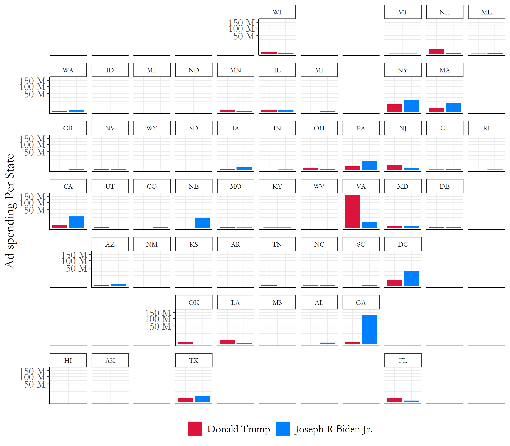

# Blog 6: The Ground Game
## 10/19/20

### The Ground Game

Following our analysis of campaigns itself, we will now be taking a look at each campaign's Ground Game efforts within the 2020 election. This can be in many forms, such as field offices, door to door volunteer knocks, text/phone banks, personal letters to voters, and more!

There are clearly many ways that candidates can reach out to voters. But which are most effective? Have campaigns been effectively using their resources to reach out to voters? How has the pandemic affected some of these candidate to voter interactions?

With these explorations, we will try to predict voter turnout rates based on current trends of early voting and ground game efforts from each candidate to bring out their supporters to the polls. However, I also do want to take some time to explore voting blocs and specific correlations demographics will have in this year's presidential election!

So, lets get on with it.

## Demographics By State

When plotting the various demographic trends within US state boundaries, there seems to be diverse waves of increase and decreases in populations for most ethnic groups within the US. In order to view this properly state by state, you can track the demographic trends from 1990 to 2018 for all 50 states below in Figure 1.


[Figure 1: Demographics for US population by State](../Rplots/week6/demographics.png)

For a more holistic view of the entire US population, we can check different demographic percentages of each Race through the pie chart below in Figure 2.


[Figure 2: 2019 United States Demographics Census Estimates ](../Rplots/week6/demographics_2019.png)
*The ad spending data for this plot was provided from https://www.fec.gov/data/*


### Biden VS Trump State level spending



[Figure 3: Campaign Ad Spending at the State Level ](../Rplots/week5/statespending_sqrt.png)

## State Level Predictions based on Ad Spending


```markdown
  state_R_ads_glm <- glm(cbind(R, VEP-R) ~ avg_poll+total_cost, state_R, family = binomial)
  state_D_ads_glm <- glm(cbind(D, VEP-D) ~ avg_poll+total_cost, state_D, family = binomial)

```

[Figure 4: Voter Turnout 2020](../Rplots/week5/VoterTurnout2020.png)

### Sooo Who wins the Electoral College?


[Figure 5: Electoral College Ad Spending Map ](../Rplots/week5/2020AdPrediction.png)

