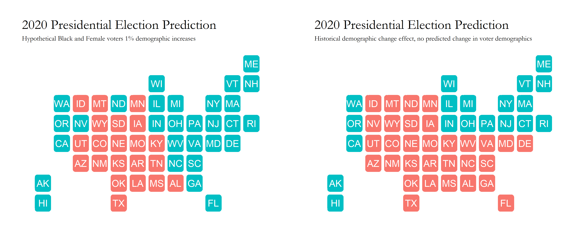

# Blog 6: Demographics / The Ground Game
## 10/19/20

### The Ground Game Discussion for 2020

Following our analysis of campaigns, another important factor to consider would be the ground game efforts made by campaigns; or the lack thereof within the 2020 election. Typically, the ground game comes in many forms, such as field offices, door to door volunteer knocks, text/phone banks, personal letters to voters, and more. However, for this 2020 election, there seems to be a drastic decrease in ground game activity, specifically on Biden's campaign trail, due to the Covid-19 pandemic. Many of his campaign efforts have switched to the air war and mass social media with minimal gatherings with voters. Trump still seems to carry out many of his campaign rallies even after being diagnosed with Covid himself, but his ground game efforts definitely have decreased as well compared to the 2016 election.

Due to the lack of datasets I could find specific to the ground game efforts of both candidates, I decided to change my focus to explore voting blocs and specific correlations within US demographics in this year's presidential election.

So, lets get on with it.

## Demographics By State

When plotting the various demographic trends within US state boundaries, there seems to be diverse waves of increases and decreases in populations for most ethnic groups within the US. In order to view this properly state by state, you can track the demographic trends from 1990 to 2018 for all 50 states below in Figure 1.

[Figure 1: Demographics for US population by State](../Rplots/week6/demographics.png)

Most states have seen decreases within levels of white populations, and increases in minority groups over this time period; this does exhibit possibiltiies of a minority majority in future years as we enter 2020 and beyond. 

For a more holistic view of the entire US population, we can check different demographic percentages of each race through the pie chart below in Figure 2. There still is a majority of white individuals within the US, with Hispanic and Black populations following after.

[Figure 2: 2019 United States Demographics Census Estimates ](../Rplots/week6/demographics_2019.png)
*The ad spending data for this plot was provided from https://data.census.gov/cedsci/all?q=demographics*

With information on the composition of the United States' different racial groups, we can correlate the relationships of the growth in different ethnic populations with increases for each party's eventual popular vote percentages. 

### Demographic Relations between Party

Now lets model the relationship between different US demographic populations with each party's popular vote percentages. After some initial exploration of various demographic variables influence on the popular vote correlations of each party, we can choose specific variables that have the highest levels of correlation with each party. Some demographic variables had minimal impacts on the actual model of the popular vote with each party, but each party did have specific demographic variables with high correlations for their popular vote percentages. 

Lets first view the democratic party relationships:

[Figure 3: Demographic Variables with highest correlations with Democrats  ](../Rplots/week6/demographicChangeEffects_Dem.png)

There seems to be high correlations with increases in the Black and Female populations with the Democratic Party's popular vote populations. With a one percent increase within the Black population, the model exhibits a **5.695** increase in the democratic population. In addition, a one percent increase within the Female population, there is an even bigger vote percentage increase of **7.014** percent. These two voting blocs have consistently been important supporting grounds for the democratic party candidates in 2008 and 2012 with Obama's election, and I predict that the level of turnout of these groups for Biden will be a large factor in whether or not he wins several key states against Trump within the electoral college.

Now lets compare that with the republican party.

[Figure 4: Demographic Variables with highest correlations with Republicans](../Rplots/week6/demographicChangeEffects_Rep.png)

Specific demographic populations that had the heighest correlations with the republican party candidate popular vote percentages included White voters, Male voters, and populations between the ages of 45-65. The highest percentage increase in the republican popular vote was with the Male population of a 1 percent increase in the population correlating to a **6.642** percent increase in the Republican Party's popular vote!

## State Level Predictions with hypothetical changes in demographic vote

Now applying these models onto the electoral college, I wanted to test a hypothetical (but very possible situation) of a 1% increase in both the Black and Female voting populations for this election. Especially with the issues at stake with this 2020 election, many election analysts have predicted higher voting rates within those two populations, so I wanted to try testing the possible consequences with a small increase in those two populations. The result is shown in Figure 5 below.

[Figure 5: Electoral College Demographic Changes Map ](../Rplots/week6/demographics_electoralCollegeMap.png)

The hypothetical situation is on the left, and the historical trend is on the right. Just with this 1% increase on both voting blocs, there is a stark difference with the number of states that come over to the democrats, with key states such as Michigan, Florida, and Ohio. Specific Electoral College numbers can be found below:

*Historical Situation:*
Biden Electoral Votes: 252
Trump Electoral Votes: 283

*Hypothetical Situation:*
Biden Electoral Votes: 361
Trump Electoral Votes: 174
