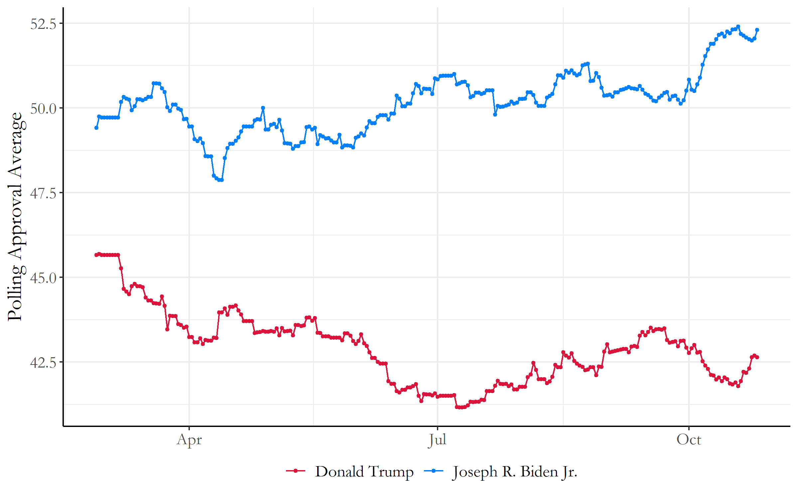
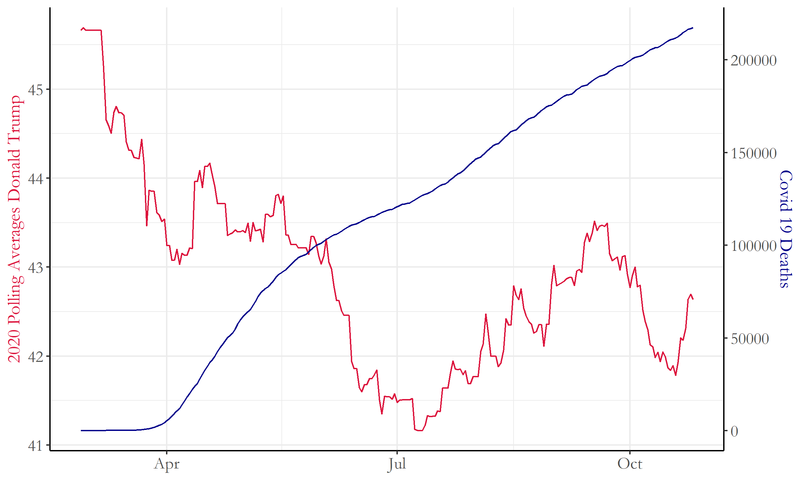
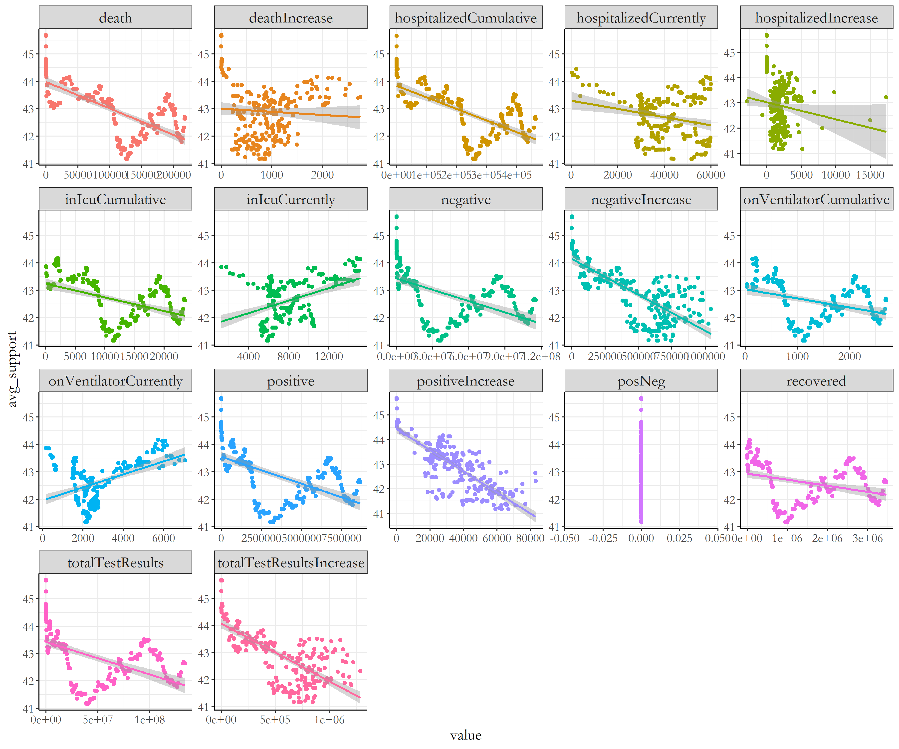
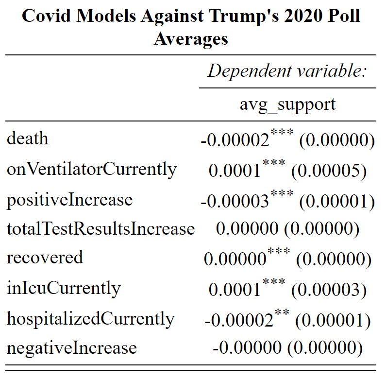

# Blog 7: Shocks - Coronavirus
## 10/26/20

### Shocks during the Election

Now with only 8 days left before election day, we have reached our final topic to discuss: shocks during election years and how much they affect voters' choices on the ballot.

Apolitical shocks have been attributed to voter attitude shifts during election years, ranging from natural disasters, shark attacks, sports, lotteries, and more. These shocks can have both positive and negative impacts on candidates, but most of these impacts are concentrated on the incumbent candidates or party during election years. Some of these shocks may seem irrational in how voters punish or reward governmental officials, like shark attacks linked with less voter support for incumbent candidates. However, there are still many cases when voters consider shocks rationally in their vote. Voters usually consider what the government could have done better within the seemingly "apolitical" shock and they consider how the nation is doing in comparison to other countries globally.

All of this seems incredibly applicable for the situation in 2020. For the largest shock none of us could have predicted for 2020: how has Covid-19 affected voters for the 2020 election?

Lets dive in :D

## Current Polling Averages 10/26/2020

Before getting into the different aspects of how Covid 19 is affecting this year's election, lets first see how the polling averages have changed this past month from the fourth blog post. This data was obtained from FiveThirtyEight to get the most recent national polling averages.

[Figure 1: Current Polling Averages 10/25/2020](../Rplots/week7/JoeVSDonald.png)

The gap between Joe Biden and Trump still seems to be growing, with recent events of Trump being diagnosed with the Coronavirus. The polling difference gap is now officially at a 10 point margin between Biden and Trump, with only a week left until election day!

### Covid Deaths V.S Trump Polling Averages

If we start to look a little closer at the average change of trends within Trump's polling average, we can see that there seems to be a close inverse relationship between the number of covid 19 deaths in the US and Trump's national polling average. I plotted both line plots in the same graph to clearly compare these changes; the scaling factor for number of covid deaths were matched in a range similar to the polling averages for Trump in order to fit them on the same graph.

[Figure 2: Covid Deaths VS Trump's Polling Averages ](../Rplots/week7/Donald_CovidDeaths.png)

We can clearly see the inverse relationship between covid deaths and Trump's polling averages within this data. With increases in covid deaths over time, there seems to be a similar decrease in Trump's polling averages over the past 7 months of the pandemic. However, I wanted to explore the relationships between these Covid statistics and Trumps polling averages a bit closer in several linear models.

## More types of Covid Data

Using data from the Covid Tracking Project (hosted from the Atlantic), I first plotted through several scatterplots Trump's polling averages in comparison to the following Covid statistics provided from the Covid Tracking Project:
- Number of deaths
- death increase
- cumulative hospitalized individuals
- and 14 others...

That is alot. But lets look at the graph below to see these results in action:

[Figure 3: Covid Statistics VS Trump Polling Averages ](../Rplots/week7/CovidVsTrump_models.png)

Many of these graphs have similar trends with each other, most notably number of covid deaths, positive tests results, and total test results. These are due to the fact that many of these numbers are directly related to each other, where number of covid deaths result from how many positive test results are found, and total tests are in a similar fashion as well. 

There seemed to be mostly negative trends within this plot, so I tried to create a model with the most variables (with minimal overlap in terms of data) that could try to explain the polling results for Trump. I chose these 8 variables:

- Number of Deaths
- currently on ventilator
- increases in positive tests
- increases in total tests
- recoveries
- currently in the ICU
- hospitalized currently
- increases in negative tests

The results of this model is seen in this table:

[Figure 4: Covid Models  ](../Rplots/week7/covidModels_trump2020Averages.png)

For this model, I focused on these values to figure out which had the most significant correlations with the polling averages for Trump. However, I realized that many of these variables are scaled differently, which made it difficult to narrow these results into just a few (except for the total test results increase and negative increases which di dnot have the number of stars needed to show their significance).

## Covid Predictions 

So with this model, I tried to make a prediction in possible changes in polling averages for this next week in the election using the most recent covid data statistics from today, as well as the addition of a forecasted covid death count from this covid tracking website from the University of washington: *https://covid19.healthdata.org/united-states-of-america/south-carolina?view=total-deaths&tab=compare*.

Trumps current national polling average is **42.6** as of Oct 26, 2020. 

Forecasting a week out to Nov 3, 2020, with a new forecasted cumulative covid death count of 232958, the predicted polling average would be **42.49421**.

There is not a huge difference in numbers. But to expand on this, Trump's polling average has been decreasing consistently with the rise of Covid 19 cases. These seemingly miniscule changes in polling popularity has accumulated to the present day where he now lags behind Biden with a 10 point national polling average! Now that's a huge gap. 

There still are precautions we should take with just only looking at polling averages, as these may not reflect the actual popular vote percentages on election day. However, this does show how Covid 19 is a shock in this 2020 election that truly had a huge impact on voters when considering reelecting the incumbent president. And it doesn't look too good for Trump.
