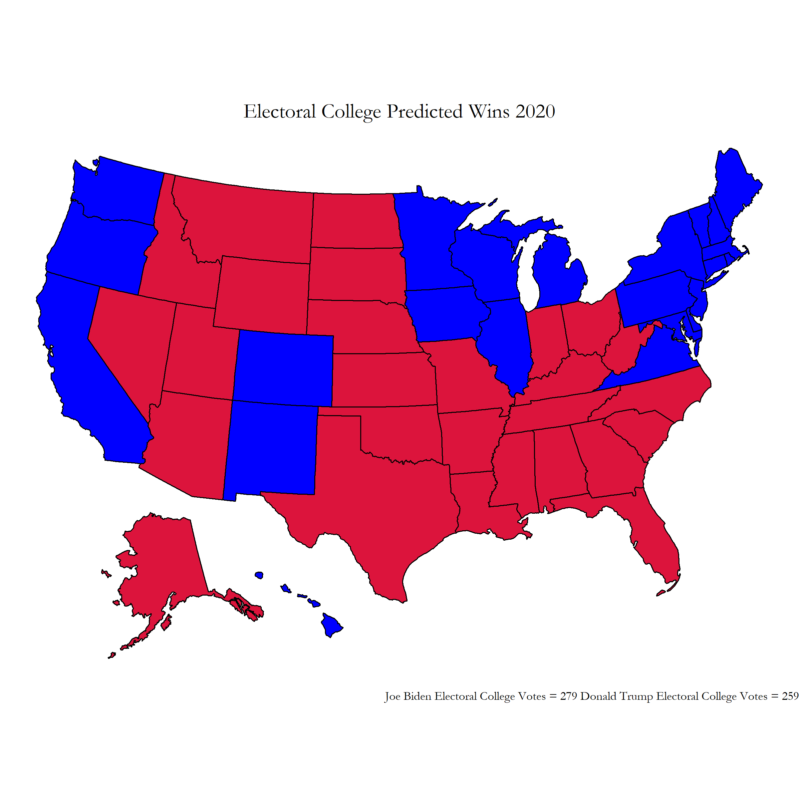
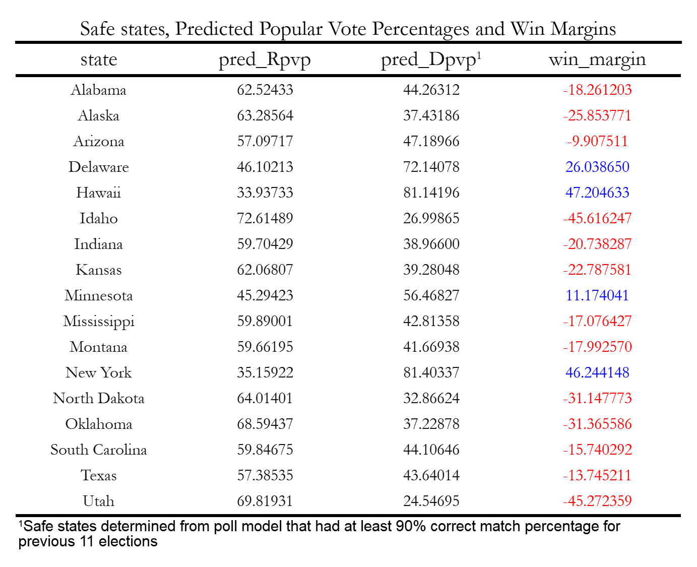
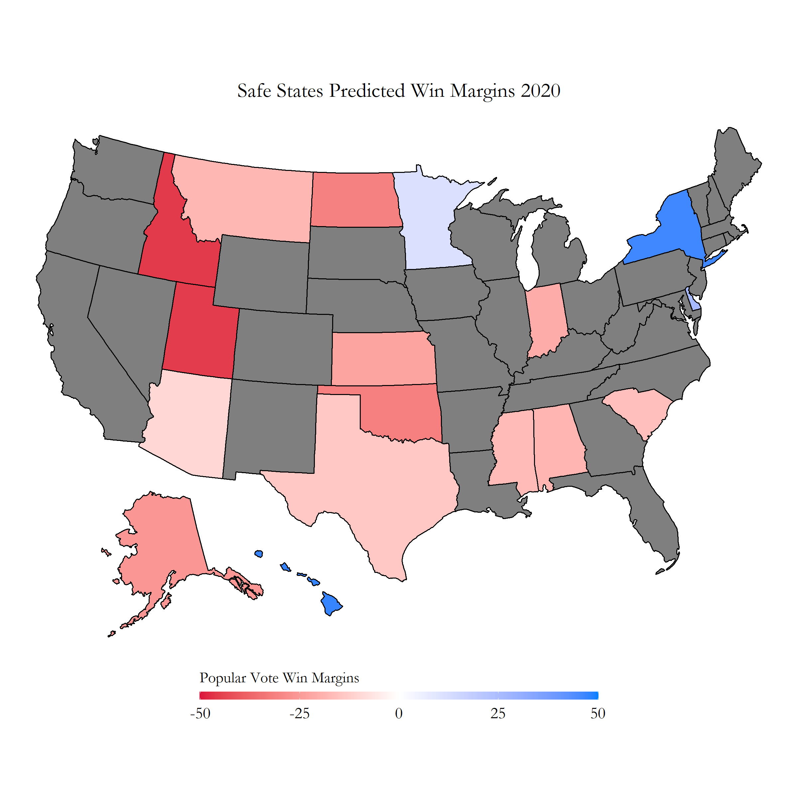
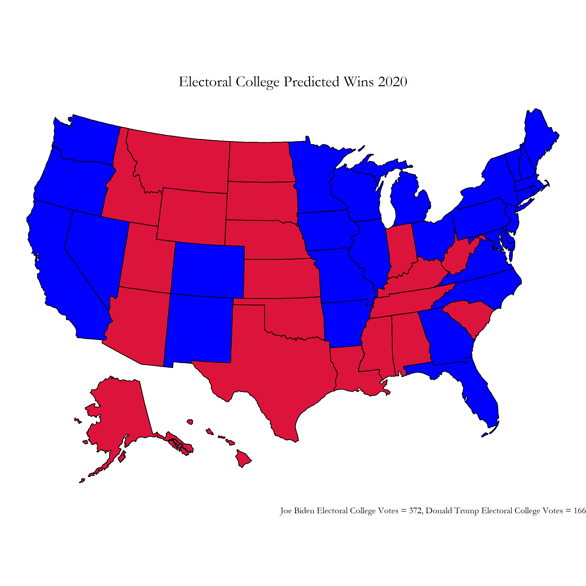
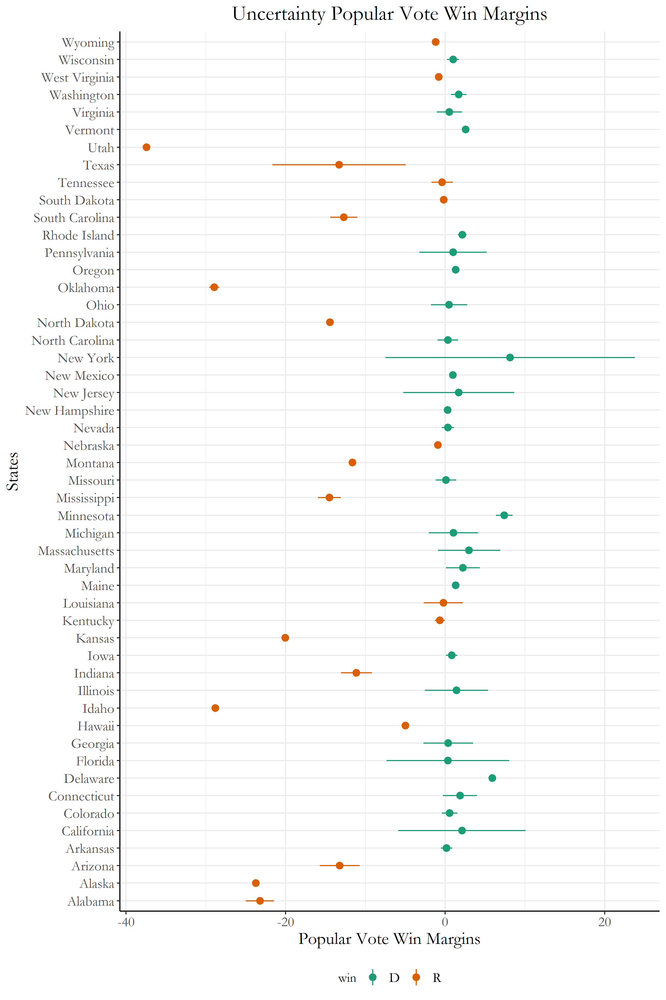

## CORRECTION: Election Map

I realized that I had made a small coding mistake that had a drastic effect on my final election prediction results. I accidentally used the republican party's polling data when predicting the democratic party's state level popular vote percentages, which can be seen in line 232 of the [r code in my week 8 blog post](https://github.com/gkim65/2020_ElectionBlogPost_gov1347/blob/gh-pages/Rplots/week8/safeStates.R)

Fixing this error, I was left with the true intended results of my prediction: 

[Fixed Electoral College Map Predictions ](../Rplots/week9/REALPredictionsWinsElectoralCollege2020.png)

[Fixed Election Popular Vote Margin Predictions ](../Rplots/week9/Final PredictionsTable.png.png)

Please use this electoral prediction map instead of the map listed further below this blog post.

# Blog 8: Final Predictions
## 11/1/20

### A few words...

We only have **2** days left before the election! 

The next few days will be a flurry of madness: long voting lines, misleading early calls for winners, and possible waits for voting counts past election night. No matter who wins or loses, lets hope for a peaceful transfer of power with faith that the next four years will not divide, but bring America together. 

Now with no further delay, lets dive right in into how we will build our forecasts for our election predictions!

## Final Forecast Model Outline

For this final forecast, we will be basing our model on these parameters:

- Polling
- Economy
- Covid Deaths

### Safe States Model

For safe states, electoral college results will be based only upon polling data. With data from the last 11 elections between the years 1976-2016, a model was created where the dependent variable: **state wide popular vote percentage**, was determined in a binomial regression using the independent variable: **polling averages 1 week from the election**. Safe states were determined based on whether the model correctly predicted the winner for at least 10 elections using out of sample testing. To see the entire table of average error and correctly determined winner percentages, please visit this link:
[Figure 1: Polling Model to Determine Safe States](../Rplots/week8/OutOfSampleTestingPolls.png)

From this out of sample testing, 17 safe states were selected to predict 2020 winning margins using only the polling model. These states all had at least 10 out of 11 elections correctly predicted using the polling model. Figure 2 contains the 2020 predicted popular vote percentages and win margins below:

[Figure 2: Popular Vote Predictions Safe States ](../Rplots/week8/SafeStatesPollModelTable.png)

To see these safe states on a map, look at Figure 3:

[Figure 3: Safe States Popular Vote Win Margins Popular Vote ](../Rplots/week8/WinMarginsSafeStates2020.png)

### The other states... Not safe... Lets include the Economy

For the rest of the states, that were not identified to have a "safe" label, an ensemble model of the economy, and state polling data will be used. Some states were found to not have polling data; for these states, the most recent national polling data was used for the ensemble calculations. These values were 52.0 for Biden, and 43.4 for Trump.

The economy model was a binomal regression using third quarter **GDP yearly growth** as the independent variable (used because it had the highest p-value of the variables tested within the economy dataset) and was tested against the dependent variable: the historical popular vote percentages from each election year. The coefficient for this economy model was **1.3410**, with a p value of **0.01**. 

To calculate the accuracy of this economy models, I also tried an out of sample testing of all the elections between the years 1948 and 2016. The economy model was not as accurate as the polling model, where only 9 out of 18 election popular vote percentages were predicted with less than 3 percent error. Specific out of sample results can be seen in Figure 4 at this link: [Figure 4: Economy model out of sample ](../Rplots/week8/EconomyPredictions_Pv2p.png). 

For the 2020 election, the model predicted a 45.27866 popular vote percentage for Trump, with a 54.72134 popular vote percentage for Biden. 

The actual ensemble model for states that were considered: "not safe" was created with the following formula:

0.85(polling model) + 0.15(economy model)

These coefficients were heuristically chosen from the number of elections each model correctly predicted from the out of sample testing. Due to lack of time, I was not able to test more coefficients in depth; but a larger economy model coefficent did lead to abnormally higher averages for Biden.

## Electoral Map and Final Popular Vote Percentages

Now using these two models together, the predictions for this 2020 election can be made!

For specific popular vote percentage predictions, please visit this link: [Figure 5: Final Popular Vote Predictions ](../Rplots/week8/Final PredictionsTable.png)

The actual electoral map for these popular vote percentages can be found below:

[Figure 6: Final Prediction Electoral Map ](../Rplots/week8/WinsElectoralCollege2020.png)

From this electoral college map, Biden wins by a landslide with **372 electoral college votes** while Trump is left with **166 electoral college votes**.

Some highlights from this prediction include Pennsylvania, Wisconsin, and Florida narrowly turning Blue. 

### Uncertainty around Prediction
There are definitely some uncertainty around these predictions. I tried to include this uncertainty by creating a lower and upper bound of my predictions based on the ratio of Covid deaths in the state VS the total Covid deaths in the nation.

These uncertainty bars can be found in this figure below:

[Figure 7: Uncertainty by state ](../Rplots/week8/Uncertainty2020.png)

As long as the win margin percentage is above 0, the state will be listed as a democrat win. However, for states with a negative win margin, the state is considered a republican win. Many of these states have very large upper and lower error bounds, and this uncertainty due to Covid definitely will be making a huge difference within this race. Although we predict that Biden will win, these are not perfect forecasts; we will need to check after Nov. 3 of how this all ends! 
