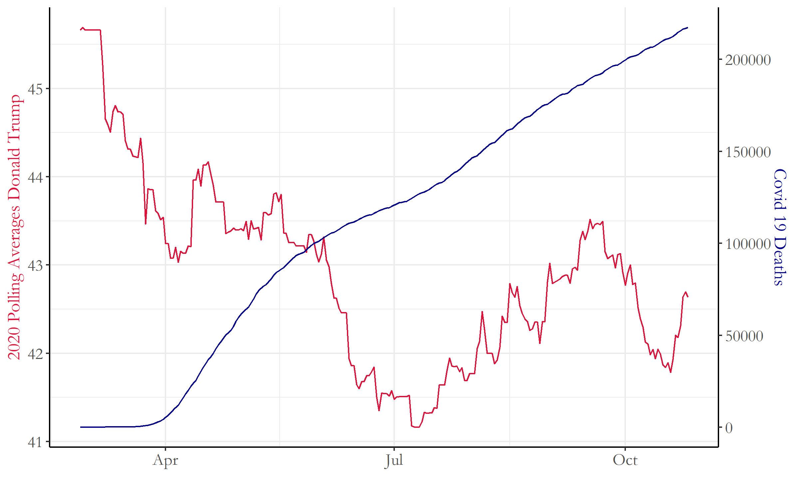
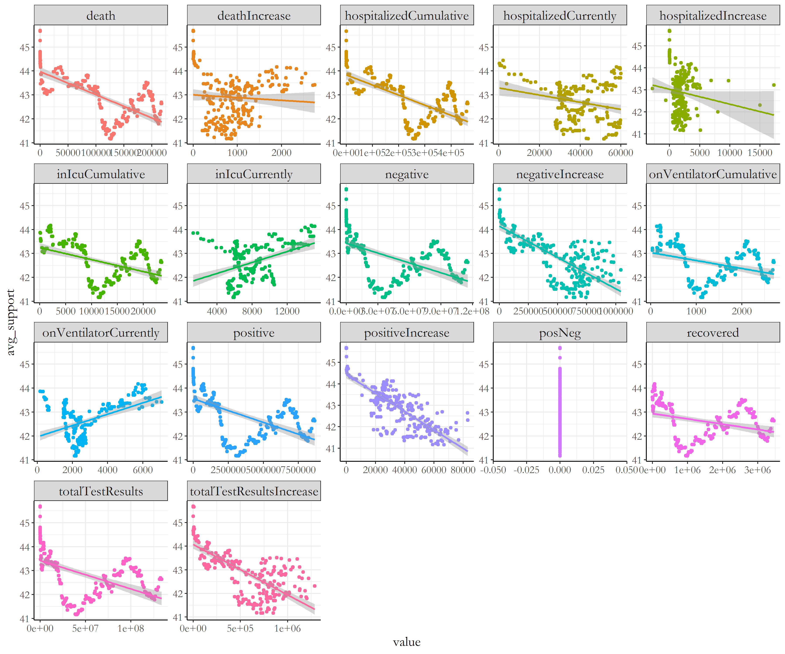
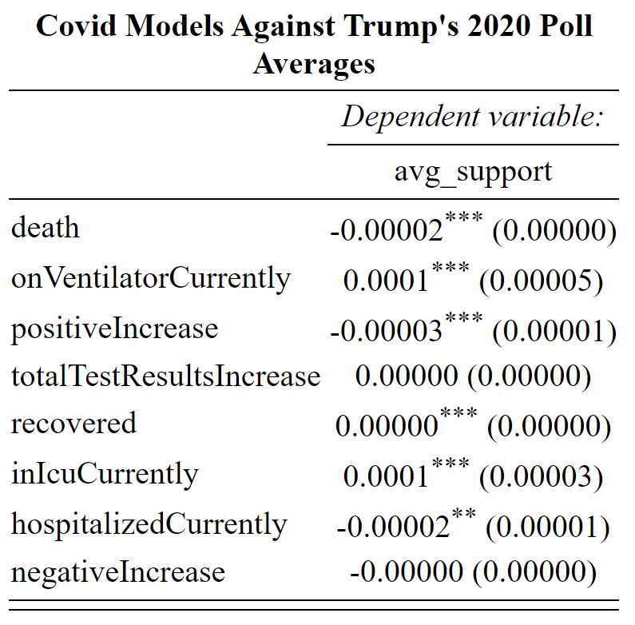

# Blog 8: Final Predictions
## 11/1/20

### A few words...

We only have **2** days left before the election! 

The next few days will be a flurry of madness: long voting lines, misleading early calls for winners, and possible waits for voting counts past election night. No matter who wins or loses, lets hope for a peaceful transfer of power with faith that the next four years will not divide, but bring America together. 

Now with no further delay, lets dive right in into how we will build our forecasts for our election predictions!

## Final Forecast Model Outline - Formula and Description

For this final forecast, we will be basing our model on these parameters:

- Polling
- Economy
- Covid-19
- Television Broadcast

For safe states, electoral college results will be based upon polling data. With data from the last 11 elections between the years 1976-2016, a model was created where the dependent variable: **state wide popular vote percentage**, was determined in a binomial regression using the independent variable: **polling averages 1 week from the election**. Safe states were determined based on whether the model correctly predicted the winner for at least 10 elections using out of sample testing. To see the entire table of average error and correctly determined winner percentages, please visit this link:
[Figure 1: Polling Model to Determine Safe States](../Rplots/week8/OutOfSampleTestingPolls.png)

From this out of sample testing, 17 safe states were selected to predict 2020 winning margins using only the polling model. These states all had at least 10 out of 11 elections correctly predicted using the polling model. Figure 2 contains the 2020 predicted popular vote percentages and win margins below:

[Figure 2: Popular Vote Predictions Safe States ](../Rplots/week8/SafeStatesPollModelTable.png)

To see these safe states on a map, look at Figure 3:

[Figure 3: Safe States Popular Vote Win Margins Popular Vote ](../Rplots/week8/WinMarginsSafeStates2020.png)

(1) model formula (or procedure for obtaining prediction), 
(2) model description and justification, 

### Formula and Weights/Coefficients
(3) coefficients (if using regression) and/or weights (if using ensemble), 
(4) interpretation of coefficients and/or justification of weights,

## Model Validation
(5) model validation (recommended to include both in-sample and out-of-sample performance unless it is impossible due to the characteristics of model and related data availability), 

### Uncertainty around Prediction
(6) uncertainty around prediction (e.g. predictive interval)

## Final Prediction statistics
(7) graphic(s) showing your prediction

[Figure 2: Covid Deaths VS Trump's Polling Averages ](../Rplots/week7/Donald_CovidDeaths.png)

[Figure 3: Covid Statistics VS Trump Polling Averages ](../Rplots/week7/CovidVsTrump_models.png)

[Figure 4: Covid Models  ](../Rplots/week7/covidModels_trump2020Averages.png)
