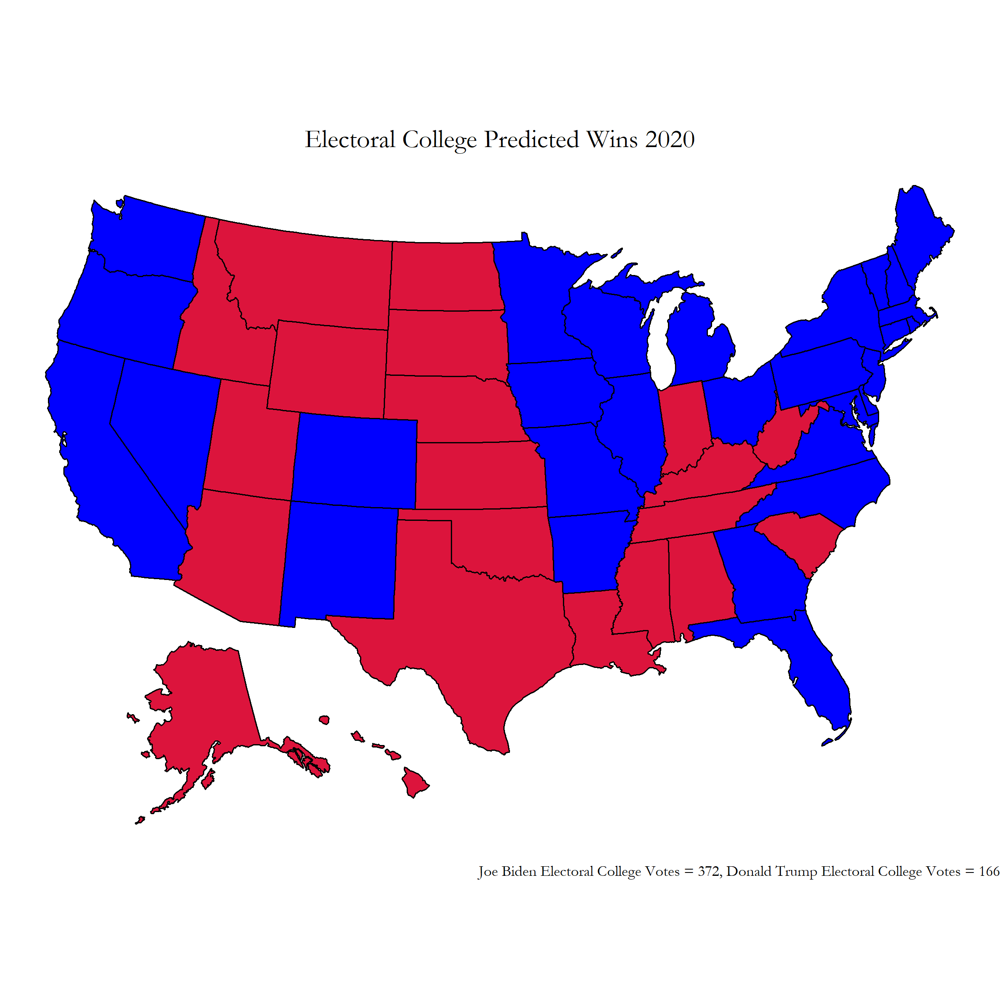

# Blog 9: Post Election Reflection
## 11/19/20

### THE ELECTIONS ARE OVER!

Finally, the results are in. *Drum-roll please...* 

Congratulations to **Joe Biden** who officially is now our **46th President Elect of the United States!** It was exciting to follow the progress of this election for the past 10 weeks, especially as it was the first election I could truly participate in as a voter! Now, politics aside of how you feel about the election result itself, lets start our post election reflection of how well our model predictions fared with the actual election!

## Model Recap

Lets look back over our final model. We based our model on these parameters:

- Polling
- Economy
- Covid Deaths

We had two separate models; one polling model for the "safe" states and one ensemble model for the remaining states. 

#### "Safe" States

States were deemed to be "safe" if my polling model correctly predicted, in out of sample testing, the winner for at least 10 out of 11 elections from the years 1976-2016. 

Predictions for these these safe states were made using the same polling election data between the years 1976-2016, where the dependent variable: **state wide popular vote percentage**, was determined in a binomial regression using the independent variable: **polling averages 1 week from the election**. To see what the 2020 popular vote percentages and win margin predictions were for these 17 states, please visit the appendix here: [Popular Vote Predictions Safe States](appendix9.md). The appendix also contains visualizations of the predicted safe states popular vote percentages on a map.

#### Remaining states ensemble model

For the remaining states, the following ensemble model was used:

**0.85(polling model) + 0.15(economy model)**

The polling model is identical to the binomial regression polling model we used for our safe states. However, I found that some states (Illinois, Nebraska, Rhode Island, South Dakota, Wyoming) did not have recent statewide polls that I could use; for these states, the most recent national polling data was used for the ensemble calculations. These values were 52.0 for Biden, and 43.4 for Trump.

The economy model was a binomal regression using third quarter **GDP yearly growth** as the independent variable. Although it was did not have as high of an out of sample testing accuracy rate as the polling model, I wanted to incorporate this fundamental variable to better represent the current state of the 2020 election. More specific descriptions of the economy model can be found at this link: [Week 8: Final Predictions (11.1.20) ](BlogPosts/blog8.md).

For the 2020 election, the economy model predicted a 45.27866 popular vote percentage for Trump, with a 54.72134 popular vote percentage for Biden. 

#### Accidental Coding Mishaps, and Fixed Electoral Map and Final Popular Vote Percentages

Using the previous ensemble and safe states models, we made our predictions for the 2020 election. This was the electoral map we showed on our last blog post:

[Figure 1: Final Prediction Electoral Map ](../Rplots/week8/WinsElectoralCollege2020.png)

From this electoral college map, Biden wins by a landslide with **372 electoral college votes** while Trump is left with **166 electoral college votes**. However, while writing this post election reflection blog entry I realized that I had made a small coding mistake that had a drastic effect on my final election prediction results. I accidentally used the republican party's polling data when predicting the democratic party's state level popular vote percentages, which can be seen in line 232 of the [R code in my week 8 blog post](https://github.com/gkim65/2020_ElectionBlogPost_gov1347/blob/gh-pages/Rplots/week8/safeStates.R).

Fixing this error, I was left with the true intended results of my prediction:

[Figure 2: Fixed Election Predictions ](../Rplots/week9/REALPredictionsWinsElectoralCollege2020.png)

This electoral college map leaves Biden winning narrowly with **279 electoral college votes** with Trump close behind at **259 electoral college votes**. The national popular vote predictions also become **53.28%** for Biden and **46.71%** for Trump.

[Fixed Election Popular Vote Margin Predictions ](../Rplots/week9/Final PredictionsTable.png.png)

### Model Accuracy

For testing my model accuracy, I will be using the error corrected model (that uses the corect polling data). Revisiting the specific popular vote counts predicted in our model, the true popular vote percentages currently are at: **%51.97** for Biden, and **%48.03** for Trump. I was about **%1.31** off for this popular vote percentage. I then plotted the specific margin of error for each state's popular vote predictions:

[Figure 3: Margin of Error Map](../Rplots/week9/MarginOfErrorMap.png)

Exploring this map, it is apparent that my model overshot how much of the popular vote Biden would receive in many of the midwest states. This did not come as much of a surprise to me, seeing how pollsters were not able to accurately reflect much of the midwest vote in the 2016 election. However, I was surprised at how much my model seemed to overpredict Trump's wins in the south as well as some west coast states. Many states in this election were won by a relatively smaller margin than in previous years, which stands to show how close this election really was.

To explore this further, I put my popular vote prediction percentage against the true 2020 election voting results in the following graph: 

[Figure 4: Lollipop Margin of Error Plot, Real VS. Predicted](../Rplots/week9/PredictedAgainstReal2020.png)

I missed a total of 4 states: Nevada, Georgia, Arizona (which went to Biden), and Iowa (which went to Trump) which gives me a brier score of **0.08**. Since lower brier scores are more favorable, this may make my model look promising. However, my model had a **root mean squared error of 11.45043%** for the states' popular vote predictions. This was a higher error percentage than I expected after seeing how close my electoral college map was. Another trend that seemed to occur within my model was an overprediction of Biden's popular vote percentages while underpredicting Trump's.

Despite some over and under predictions, my model seems to be a much more reliable predictor of Biden's popular vote percentages compared to Trump. The margins between the true popular vote compared to the predictions are much more sporatic on Trump's end of the scale compared to Biden's. I would attribute these findings to the difficulty pollsters continuously faced in trying to accurately survey the number of Trump supporters across the United States. This may be because Trump's main voter groups such as the rural, non college educated white voters are less likely to respond to public polls due to such widespread belief in the presence of "fake news" within today's media.

## Possible Model Inaccuracies

One area that could have created these inaccuracies within my model is the economy. Due to how unique the economic decline was for 2020 from the pandemic, it seems to be a less reliable factor to describe how the current political state is within the US. In addition, despite GDP growth having reached an all time low, many voters in the US seem to not attribute this economic decline as fault to the current sitting president. Looking at these changes in voter attitude, the economy may develop over time to become a less predictive factor of future presidential elections.

Another area I would like to examine more is finding ways to properly include turnout probabilities for various demographic populations in the US. Having only used raw polling data for my inital models, I believe my predictions did not dive deeply to the details and intricacies of predicted turnout for various racial and ethnic groups. For example, Georgia had a very high turnout rate fpr black voters which gave the state the push it needed to turn blue for Biden rather than stay a red state. Being able to predict and take into account which voter populations will have higher turnouts in future elections definitely would reduce many of the inaccuracies we see from relying solely on high level polling data.

### Tests for Model Inaccuracy Hypotheses

Some ways I could test the economy inaccuracy hypothesis is by tracking the number of correctly predicted elections over time. By obtaining data for GDP growth for every single election year that has occured in the past up to the present, I can see if the model tends to lower in predictive ability every time I add a data point for a new election year. If this data was available up to the next 50 elections into the future, we could truly get a good grasp of how well our correlations are growing between the economy and voter support. This would also allow us to check how well the economy predicts voter support during years with huge economic declines. 

For the proposed demographics inaccuracies within polling models, we could prove this by first obtaining how the demographic makeup of the US population has changed over the past 70 years. Then, we need to obtain data of how each demographic group has voted for each party over those 70 years, and see when each group had large turnout rates for each election. Then using this information, we would check for the demographic makeup of the polls in the 2020 election and adjust our polling data accordingly to our predictions in how turnout for each demographic group would look for this election. If this test provides us a closer result to the final electoral college map for the 2020 election, we know that this was a beneficial component to include in our model.

## Model Improvements for the Future

If I was to build my model again, one area I would like work on more is finding ways to include demographic shifts in party support over time for my polling model. As my raw polling data cannot describe how various demographic groups changed in preferences for different party, I don't think I truly captured the shift in the latino vote to favor Trump for this election. Having a component of our model that can take into account of these changes in support for different demographic groups over time definitely would provide us a much better perspective in tracking where voters are leaning towards election day.